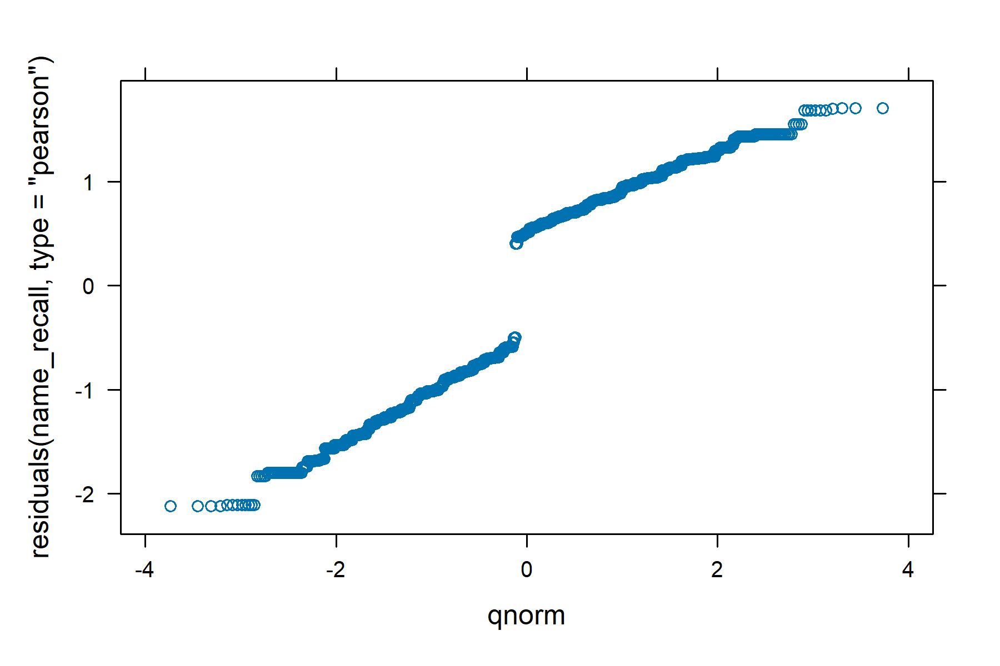

```{r setup, include=FALSE}
knitr::opts_chunk$set(echo = TRUE)
```

<style>
body {
  font-family: 'Arial', sans-serif;
  line-height: 1.6;
  margin: 0 auto;
  max-width: 950px;
  padding: 10px;
}
</style>

This document includes all information referenced in the main paper. We show full details of the process of analysis and the steps taken to ensure the statistical viability of those reported, documenting what the pre-registered models were and providing justification in cases where the final models differed. 

As a supplementary analysis, we also show how differences between the adverts impacted key outcome variables. However, keep in mind the mixed-effect models used tested if the main effects were generalisable beyond specific stimuli-level differences. The advert-level results are provided here for context but do not affect the generalisability or statistical robustness of our primary conclusions. 

### Model Fit Considerations

For hypotheses 1-3 we used mixed-effect modelling techniques. It is essential for random effect model structures to be theoretically motivated and justified (Brown, 2021). During the pre-registration stage, it was reasoned the inclusions of two separate random intercept terms set for participants (1,322 grouping levels) and each material (four grouping levels) were the most suitable due to how each participant would approach the materials with a different evaluative baseline, and in turn each piece of material differed in its message and format creating its own baseline through which it would be judged from. However, during the process of data analysis, some key considerations came to light which concerned best practice for multi-level models, a topic debated across the literature.

For example, it is recognised that not accounting for correlations within the random effects increases the risk of a type 1 error when estimated fixed effects (Matuschek et al., 2017). For this reason, Barr et al. (2013) recommend always opting for the ‘maximal’ model (with the highest complexity) that can be theoretically justified. However, increasing model complexity also reduces statistical power, requiring consideration as to whether it can be deemed a necessary trade off (Matuschek et al., 2017). Matuschek et al. (2017) recommend using estimators of model fit, such as the Likelihood Ratio Test (LRT) and the Akaike Information Criterion (AIC) to check if increasing complexity substantially improves model fit.

This point is relevant because, during the analysis, other theoretically viable model structures were identified that supported a more complex random effect structure. For example, adding a random slope term would account for whether the effect of a digital imprint varied depending on the unique characteristics of the material—i.e., if the digital imprint was effective on some materials but not others. Consequently, various theoretically justified models were tested to find a random effects structure that balanced complexity with good model fit. Following the recommendations in Matuschek  et al. (2017), to assess model suitability we used likelihood ratio tests (LRT) to compare nested models (e.g., the addition of interaction terms between fixed effects) and AIC to compare models with different random effect structures. Models with lower AIC values indicate a better relative fit for the data (Cavanaugh and Neath, 2019), helping determine if additional complexity improves (or weakens) model performance (Matuschek et al., 2017). Out of all model variants tested, the model with the lowest AIC - if it would converge - was used as a baseline. Those with an AIC within two units of the lowest were considered viable, while those between two and ten units of the lowest were deemed less supported. Models with AIC values ten units or more above the best model were considered unsupported as a model structure (for an explanation see Cavanaugh and Neath, 2019). Full details of alternative models are provided, and deviations from pre-registered models are transparently discussed. 

Criteria for determining model support (Cavanaugh & Neath, 2019):

- Model with the lowest AIC = best model fit
- Within 0-2 of lowest model = viable model and should still be considered if it better reflects the theoretical motivations of the analysis
- Within 2-10 of the lowest model = low support for the model 
- 10+ of the lowest model = no support for this model

<details>

### Preparing the dataset {.tabset}

#### Libraries used

```{r libraries needed}

library(dplyr)
library(tidyr)
library(stringr)
library(purrr)

```

#### Reading in data and exclusions

```{r read df}

data <- read.csv("rawdata_with_wranglecode/main_data.csv")

#change name of row number identifier

data <- data %>% 
  mutate(id = row_number())

#removing missing data rows from dataset (12 in total) for participants who did not complete the survey

rows_with_blank_in_name <- grepl("^\\s*$", data$EPE_5)
df_with_blanks_in_name <- data[rows_with_blank_in_name, ]

data <- data[!rows_with_blank_in_name, ]

#removing row numbers from the dataset where both attention checks were failed (the process that identified these row numbers can be viewed in 'data_quality_check.Rmd')

data <- data %>%
  filter(!(row_number() %in% c(420, 948, 1288, 1315)))

#removing exclusions based on half the median time, 360 seconds

data <- data %>%
  filter(Duration..in.seconds. >= 360)

#this should leave a data-frame with 1322 observations

```

```{r new dataframe}

#extract relevant variables into new data frame

data <- data %>%
  select(id, Training.condition, Advert.1, Advert.2, Advert.3, Advert.4, starts_with("PK"), starts_with("agree"), starts_with("informed"), starts_with("accurate"), starts_with("believable"), starts_with("trustworthy"), starts_with("factual"), election_reg, recall_num, recall_name, starts_with("useful"), reg_know, starts_with("EPE"), starts_with("general_confidence"), starts_with("institution"), democracy, political_interest, external_efficacy, internal_efficacy, starts_with("SM"), partyID, age_sample, gender, education, Ethnicity.simplified)

```

#### Agree/disagree item transformations

The code below will convert all variables with response measurement of strongly disagree to strongly agree from a character variable to a numerical scale of 1-7. One item also needs to be reverse scored:

- Informed item 3: 'I am not sure who is behind this material'

There are also attention checks in the dataset that need to be removed **once exclusions have been dealt with**:

- informed_2_5
- informed_2imprint_5
- EPE_5

Below creates a functions that will be applied to all agree-disagree response formats in the dataset - all ones that start with PK, agree, informed, EPE and general_confidence. The second function then reverse scores informed item three across the eight advert variations.

```{r convert to numeric}

#converting to numeric variables from character for agree - disagree
#Persuasion knowledge measures accidentally has a slightly different response option compared to other measures, meaning 2 conversion functions are needed. Instead of 'somewhat' they got 'slightly'.

convert_numeric1 <- function(response) {
  
  # Trim leading and trailing whitespace and convert to lowercase
  response_cleaned <- tolower(trimws(response))
  
  # Define the mapping with all lowercase keys
  mapping <- c(
    "strongly disagree" = 1,
    "disagree" = 2,
    "slightly disagree" = 3,
    "neither agree nor disagree" = 4,
    "slightly agree" = 5,
    "agree" = 6,
    "strongly agree" = 7
  )
  
  # Return the mapped value, or NA if the response does not match
  return(ifelse(!is.na(mapping[response_cleaned]), mapping[response_cleaned], NA))
}

convert_numeric2 <- function(response) {
  
  # Trim leading and trailing whitespace and convert to lowercase
  response_cleaned <- tolower(trimws(response))
  
  # Define the mapping with all lowercase keys
  mapping <- c(
    "strongly disagree" = 1,
    "disagree" = 2,
    "somewhat disagree" = 3,
    "neither agree nor disagree" = 4,
    "somewhat agree" = 5,
    "agree" = 6,
    "strongly agree" = 7
  )
  
  # Return the mapped value, or NA if the response does not match
  return(ifelse(!is.na(mapping[response_cleaned]), mapping[response_cleaned], NA))
}

#applying this function to the data frame (two separate functions to account for differences in response options)
         
data <- data %>%
  mutate(across(starts_with("PK"), convert_numeric1))

data <- data %>%
  mutate(across(c(starts_with("informed"), starts_with("agree"), starts_with("EPE"), starts_with("general")), ~convert_numeric2(.x)))

#reverse scoring informed item 3

reverse_code <- function(response) {
  # Define the mapping from original to reversed scores
  mapping <- c(1, 2, 3, 4, 5, 6, 7)
  names(mapping) <- c(7, 6, 5, 4, 3, 2, 1)
  
  # Use the response as a name to look up in the mapping
  return(as.numeric(names(mapping)[match(response, mapping)]))
}

data <- data %>%
  mutate(across(c(informed_1_3, informed_1imprint_3, informed_2_3, informed_2imprint_3, informed_3_3, informed_3imprint_3, informed_4_3, informed_4imprint_3), ~reverse_code(.x)))

#removing the attention check columns from the dataset

data <- data %>%
  select(-informed_2_5, -informed_2imprint_5, -EPE_5)

```

#### Variable tranformations for both RM and IM dataframes

The code below conducts the following transformations to the variables that will be present in both the repeated measures and independent measures data frames so they are ready to be analysed:

-   **Transformed to a factor**: advert.1, advert.2, advert.3, advert.4, Training.condition, reg_know, SM_use, starts with: SM_frequency, party_ID, gender, education

-   **Transformed to a numerical variable**: election_reg, starts with: useful_rank, starts with: institution_trust, democracy, political_interest, external_efficacy, internal_efficacy, age

*Some variables will only be present in the repeated measures data frame and will be created later.*

```{r convert to factor function}

#creating factor variables through use of a function

convert_to_factor <- function(df, cols) {
  df %>%
    mutate(across(all_of(cols), as.factor))
}

data <- data %>%
  convert_to_factor(c("Advert.1", "Advert.2", "Advert.3", "Advert.4", "SM_frequency_1", "SM_use", "Training.condition", "reg_know", "SM_use", "partyID", "gender", "education", "Ethnicity.simplified"))

#Setting reference groups for: reg_know, SM_use, SM_frequency, gender, education, ethnicity

#regulation knowledge

reg_response_order <- c("There are no regulatory controls on any type of political advertising during UK elections", "All political advertising is regulated by rules set by the UK government, but there is one set of rules for advertising on television and radio and a different set of rules for advertising on the internet and social media", "All political advertising (whether on television, radio, in newspapers or the internet) is subject to the same rules set by the UK government", "Not sure")

data <- data %>%
  mutate(across(reg_know, ~factor(.x, levels = reg_response_order)))

#Social media use
  
use_response_order <- c("None, No time at all ", "Less than 1/2 hour ", "1/2 hour to 1 hour ", "1 to 2 hours ",  "Not sure")

data <- data %>%
  mutate(across(SM_use, ~factor(.x, levels = use_response_order)))
  
#SM frequency use
  
freq_response_order <- c("Never",
                         "Less than once a week",
                         "Once a week\t",
                         "Once every couple of days\t",
                         "Once a day\t",
                         "2-5 times a day",
                         "More than five times a day\t")

data <- data %>%
  mutate(across(SM_frequency_1, ~factor(.x, levels = freq_response_order)))

#gender, female as reference

gender_response_order <- c("Female", "Male", "Non-binary / third gender", "Prefer not to say")

data <- data %>%
  mutate(across(gender, ~factor(.x, levels = gender_response_order)))

#Education level, postgrad as reference

ed_response_order <- c("Postgraduate (e.g. M.Sc, Ph.D)", "Undergraduate University (e.g. BA, B.Sc, B.Ed)", "A-level, or equivalent", "GCSE level, or equivalent", "Other, please specify", "No formal qualifications")

data <- data %>%
  mutate(across(education, ~factor(.x, levels = ed_response_order)))

#Ethnicity level, white as reference

ethn_response_order <- c("White", "Asian", "Black", "Mixed", "Other")

data <- data %>%
  mutate(across(Ethnicity.simplified, ~factor(.x, levels = ethn_response_order)))


```

```{r convert to numeric function}

#Need to first change response options from categories to numbers for: election_reg, institution_trust, democracy, political_interest, internal_efficacy, external_efficacy, age

#Confidence in electoral regulation

data <- data %>%
  mutate(election_reg = case_when(
    election_reg == "Completely insufficient" ~ 1,
    election_reg == "Mostly insufficient" ~ 2,
    election_reg == "Slightly insufficient" ~ 3,
    election_reg == "No opinion/not sure" ~ 4,
    election_reg == "Slightly sufficient" ~ 5,
    election_reg == "Mostly sufficient" ~ 6,
    election_reg == "Completely sufficient" ~ 7
  ))

#Converting 'democracy' to a numeric variable

data <- data %>%
  mutate(democracy = case_when(
    democracy == "Very dissatisfied" ~ 1,
    democracy == "A little dissatisfied" ~ 2,
    democracy == "Fairly satisfied" ~ 3,
    democracy == "Very satisfied" ~ 4
  ))

#converting political interest to a numerical variable

data <- data %>%
  mutate(political_interest = case_when(
    political_interest == "Not at all interested" ~ 1,
    political_interest == "Not very interested" ~ 2,
    political_interest == "Slightly interested" ~ 3,
    political_interest == "Fairly interested" ~ 4,
    political_interest == "Very interested " ~ 5
  ))

#converting internal and external efficacy to numeric, 5 options

data <- data %>%
  mutate(internal_efficacy = case_when(
    internal_efficacy == "Not at all " ~ 1,
    internal_efficacy == "A little " ~ 2,
    internal_efficacy == "A moderate amount  " ~ 3,
    internal_efficacy == "A lot " ~ 4,
    internal_efficacy == "A great deal " ~ 5
  ))

data <- data %>%
  mutate(external_efficacy = case_when(
    external_efficacy == "Not at all " ~ 1,
    external_efficacy == "A little " ~ 2,
    external_efficacy == "A moderate amount  " ~ 3,
    external_efficacy == "A lot " ~ 4,
    external_efficacy == "A great deal " ~ 5
  ))

#creating numeric variables through the use of a function

convert_to_numeric <- function(df, cols) {
  df %>%
    mutate(across(all_of(cols), as.numeric))
}

#age

data$age_sample <- as.numeric(data$age_sample)

#Convert all other variables to numeric

data <- data %>%
  convert_to_numeric(c("useful_rank_1", "useful_rank_2", "useful_rank_3", "useful_rank_4", "useful_rank_5", "useful_rank_6"))

```

#### Recall variable transformations

Transformation of recall variables:

-   **Recall_num**: two new columns need to be created specifying those who picked 'not sure' versus those who chose an answer, then those who were correct, chose 2, and those who were incorrect. 
-   **Recall_name**: 8 potential columns will need to be created with a binary response, indicating whether each name option was identified e.g. 'common sense collective'. 

- The correct identification options are:
  - Common sense collective - advert 1
  - Breaking barriers alliance - advert 2
  - Speak freely Inc.- advert 3
  - Campaign for a better Britain - advert 4
  
- Incorrect options
  - Future first
  - The peoples movement
  - Voice for the people
  - Hope something - removed from qualtrics and replaced with ad 4
  - All together


```{r recall name and num tranformations}

#Recall number transformation for correct/incorrect response

data <- data %>%
  mutate(recall_correct = 
           case_when(
             recall_num == 2 ~ "correct",
             TRUE ~ "incorrect"
           ))

#Recall name transformation, correct responses

data <- data %>%
  mutate(CSC = case_when(
    str_detect(recall_name, "Common Sense Collective") ~ 1,
    TRUE ~ 0
  ))

data <- data %>%
  mutate(BBA = case_when(
    str_detect(recall_name, "Breaking Barriers Alliance") ~ 1,
    TRUE ~ 0
  ))

data <- data %>%
  mutate(SFI = case_when(
    str_detect(recall_name, "Speak Freely Inc") ~ 1,
    TRUE ~ 0
  ))

data <- data %>%
  mutate(CBB = case_when(
    str_detect(recall_name, "Campaign for a better Britain") ~ 1,
    TRUE ~ 0
  ))

#incorrect responses

data <- data %>%
  mutate(FF = case_when(
    str_detect(recall_name, "Future First") ~ 1,
    TRUE ~ 0
  ))

data <- data %>%
  mutate(TPM = case_when(
    str_detect(recall_name, "The People’s movement") ~ 1,
    TRUE ~ 0
  ))

data <- data %>%
  mutate(VFP = case_when(
    str_detect(recall_name, "Voice for the People") ~ 1,
    TRUE ~ 0
  ))

data <- data %>%
  mutate(AT = case_when(
    str_detect(recall_name, "All Together") ~ 1,
    TRUE ~ 0
  ))

#number of correct names recalled, name_correct

data <- data %>%
  mutate(name_correct = CSC + BBA + SFI + CBB)

#number of incorrect names recalled, name_incorrect

#add incorrect columns together

data <- data %>%
  mutate(name_incorrect = FF + TPM + VFP + AT)

#convert campaign names to factors

data <- data %>%
  convert_to_factor(c("recall_correct", "CSC", "BBA", "SFI", "CBB", "FF", "TPM", "VFP", "AT"))

```

#### Repeated measures dataframe

The code below turns the wide data into long data, creating 4 rows for each participant and only one column for each of the outcome variables: persuasion knowledge, political goal, informedness, agreement, believability, trustworthiness, accurateness, factual. Extra columns also specify the advert viewed and the version (imprint or no imprint).

```{r convert wide to long data for repeated measures df}

#create a new dataframe with only the repeated measures (post-advert) variables

RM <- data %>%
  select(id, starts_with("Advert."), starts_with("PK"), starts_with("agree"), starts_with("informed"), starts_with("accurate"), starts_with("believable"), starts_with("trustworthy"), starts_with("factual"))

#when first converted into long data, eight rows are generated for each participant for the eight different advert variations, but many columns contain NA.

#persuasion knowledge df, each item separate

PK1_long <- RM %>%
  select(id, starts_with("Advert."), PK_1_1, PK_1imprint_1, PK_2_1, PK_2imprint_1, PK_3_1, PK_3imprint_1, PK_4_1, PK_4imprint_1) %>%
  pivot_longer(
    cols = c(PK_1_1, PK_1imprint_1, PK_2_1, PK_2imprint_1, PK_3_1, PK_3imprint_1, PK_4_1, PK_4imprint_1),
    names_to = "PK1",
    values_to = "PK1_value"
  )

PK2_long <- RM %>%
  select(id, starts_with("Advert."), PK_1_2, PK_1imprint_2, PK_2_2, PK_2imprint_2, PK_3_2, PK_3imprint_2, PK_4_2, PK_4imprint_2) %>%
  pivot_longer(
    cols = c(PK_1_2, PK_1imprint_2, PK_2_2, PK_2imprint_2, PK_3_2, PK_3imprint_2, PK_4_2, PK_4imprint_2),
    names_to = "PK2",
    values_to = "PK2_value"
  )

PK3_long <- RM %>%
  select(id, starts_with("Advert."), PK_1_3, PK_1imprint_3, PK_2_3, PK_2imprint_3, PK_3_3, PK_3imprint_3, PK_4_3, PK_4imprint_3) %>%
  pivot_longer(
    cols = c(PK_1_3, PK_1imprint_3, PK_2_3, PK_2imprint_3, PK_3_3, PK_3imprint_3, PK_4_3, PK_4imprint_3),
    names_to = "PK3",
    values_to = "PK3_value"
  )

PK4_long <- RM %>%
  select(id, starts_with("Advert."), PK_1_4, PK_1imprint_4, PK_2_4, PK_2imprint_4, PK_3_4, PK_3imprint_4, PK_4_4, PK_4imprint_4) %>%
  pivot_longer(
    cols = c(PK_1_4, PK_1imprint_4, PK_2_4, PK_2imprint_4, PK_3_4, PK_3imprint_4, PK_4_4, PK_4imprint_4),
    names_to = "PK4",
    values_to = "PK4_value"
  )


#political goal df, informed item 1

PG_long <- RM %>%
  select(id, starts_with("Advert."), informed_1_1, informed_1imprint_1, informed_2_1, informed_2imprint_1, informed_3_1, informed_3imprint_1, informed_4_1, informed_4imprint_1) %>%
  pivot_longer(
    cols = c(informed_1_1, informed_1imprint_1, informed_2_1, informed_2imprint_1, informed_3_1, informed_3imprint_1, informed_4_1, informed_4imprint_1),
    names_to = "political_goal",
    values_to = "PG_value"
  )

#informed df, each item separate

informed2_long <- RM %>%
  select(id, starts_with("Advert."), informed_1_2, informed_1imprint_2, informed_2_2, informed_2imprint_2, informed_3_2, informed_3imprint_2, informed_4_2, informed_4imprint_2) %>%
  pivot_longer(
    cols = c(informed_1_2, informed_1imprint_2, informed_2_2, informed_2imprint_2, informed_3_2, informed_3imprint_2, informed_4_2, informed_4imprint_2),
    names_to = "informed2",
    values_to = "informed2_value"
  )

informed3_long <- RM %>%
  select(id, starts_with("Advert."), informed_1_3, informed_1imprint_3, informed_2_3, informed_2imprint_3, informed_3_3, informed_3imprint_3, informed_4_3, informed_4imprint_3) %>%
  pivot_longer(
    cols = c(informed_1_3, informed_1imprint_3, informed_2_3, informed_2imprint_3, informed_3_3, informed_3imprint_3, informed_4_3, informed_4imprint_3),
    names_to = "informed3",
    values_to = "informed3_value"
  )

informed4_long <- RM %>%
  select(id, starts_with("Advert."), informed_1_4, informed_1imprint_4, informed_2_4, informed_2imprint_4, informed_3_4, informed_3imprint_4, informed_4_4, informed_4imprint_4) %>%
  pivot_longer(
    cols = c(informed_1_4, informed_1imprint_4, informed_2_4, informed_2imprint_4, informed_3_4, informed_3imprint_4, informed_4_4, informed_4imprint_4),
    names_to = "informed4",
    values_to = "informed4_value"
  )

#agreement df

agree_long <- RM %>%
  select(id, starts_with("Advert."), starts_with("agree")) %>%
  pivot_longer(
    cols = starts_with("agree"),
    names_to = "agree",
    values_to = "agree_value"
  )

#trustworthy df

trustworthy_long <- RM %>%
  select(id, starts_with("Advert."), starts_with("trustworthy")) %>%
  pivot_longer(
    cols = starts_with("trustworthy"),
    names_to = "trustworthy",
    values_to = "trustworthy_value"
  )

#believability df

believe_long <- RM %>%
  select(id, starts_with("Advert."), starts_with("believable")) %>%
  pivot_longer(
    cols = starts_with("believable"),
    names_to = "believable",
    values_to = "believable_value"
  )

#accurateness df

accurate_long <- RM %>%
  select(id, starts_with("Advert."), starts_with("accurate")) %>%
  pivot_longer(
    cols = starts_with("accurate"),
    names_to = "accurate",
    values_to = "accurate_value"
  )

#factual df

factual_long <- RM %>%
  select(id, starts_with("Advert."), starts_with("factual")) %>%
  pivot_longer(
    cols = starts_with("factual"),
    names_to = "factual",
    values_to = "factual_value"
  )

#Create two new variables in each indicating advert type and version viewed, so that the dataframes can be merged by these two columns

#Below is three functions that can be applied to each df to create new variables.

# Function to add 'advert' and 'version' based on patterns in a specified column
add_advert_version <- function(data, column_name) {
  data %>%
    mutate(
      advert = case_when(
        str_detect(!!sym(column_name), "1") ~ "advert.1",
        str_detect(!!sym(column_name), "2") ~ "advert.2",
        str_detect(!!sym(column_name), "3") ~ "advert.3",
        str_detect(!!sym(column_name), "4") ~ "advert.4",
        TRUE ~ NA_character_
      ),
      version = case_when(
        str_detect(!!sym(column_name), "imprint") ~ 1,
        TRUE ~ 0
      )
    ) 
}

#apply function for agree, trust, believe, factual, accurate

agree_long <- add_advert_version(agree_long, "agree")
trustworthy_long <- add_advert_version(trustworthy_long, "trustworthy")
believe_long <- add_advert_version(believe_long, "believable")
accurate_long <- add_advert_version(accurate_long, "accurate")
factual_long <- add_advert_version(factual_long, "factual")

#PK function

PK_advert_version <- function(data, column_name) {
  data %>%
    mutate(
      advert = case_when(
        str_detect(!!sym(column_name), "PK_1") ~ "advert.1",
        str_detect(!!sym(column_name), "PK_2") ~ "advert.2",
        str_detect(!!sym(column_name), "PK_3") ~ "advert.3",
        str_detect(!!sym(column_name), "PK_4") ~ "advert.4",
        TRUE ~ NA_character_
      ),
      version = case_when(
        str_detect(!!sym(column_name), "imprint") ~ 1,
        TRUE ~ 0
      )
    ) 
}

PK1_long <- PK_advert_version(PK1_long, "PK1")
PK2_long <- PK_advert_version(PK2_long, "PK2")
PK3_long <- PK_advert_version(PK3_long, "PK3")
PK4_long <- PK_advert_version(PK4_long, "PK4")

#informed function

in_advert_version <- function(data, column_name) {
  data %>%
    mutate(
      advert = case_when(
        str_detect(!!sym(column_name), "informed_1") ~ "advert.1",
        str_detect(!!sym(column_name), "informed_2") ~ "advert.2",
        str_detect(!!sym(column_name), "informed_3") ~ "advert.3",
        str_detect(!!sym(column_name), "informed_4") ~ "advert.4",
        TRUE ~ NA_character_
      ),
      version = case_when(
        str_detect(!!sym(column_name), "imprint") ~ 1,
        TRUE ~ 0
      )
    ) 
}

PG_long <- in_advert_version(PG_long, "political_goal")
informed2_long <- in_advert_version(informed2_long, "informed2")
informed3_long <- in_advert_version(informed3_long, "informed3")
informed4_long <- in_advert_version(informed4_long, "informed4")

#the code below creates a function that filters out redundant rows, leaving 4 for each participant

clean_NA <- function(df) {
  # Identify the column(s) ending with '_value'
  value_cols <- names(df)[grepl("_value$", names(df))]
  
  # Ensure there is at least one column ending with '_value'
  if (length(value_cols) > 0) {
    df <- df %>%
      filter(!is.na(.[[value_cols]])) %>%
      distinct(id, advert, .keep_all = TRUE)
  }
  
  return(df)
}

#apply this function to all dataframes, specified through thier shared name of '_long' at the end of each df

df_names <- ls(pattern = "_long$")
df_list <- mget(df_names, envir = .GlobalEnv)

for (name in names(df_list)) {
  assign(name, clean_NA(get(name)), envir = .GlobalEnv)
}

#merge the dataframes back together by matching advert, participant id and version

rm_list <- list(PK1_long, PK2_long, PK3_long, PK4_long, PG_long, informed2_long, informed3_long, informed4_long, agree_long, trustworthy_long, accurate_long, believe_long, factual_long)

merged_rm <- reduce(rm_list, full_join, by = c("id", "advert", "version", "Advert.1", "Advert.2", "Advert.3", "Advert.4"))

#changing order of columns

merged_rm <- merged_rm %>%
  select(id, Advert.1, Advert.2, Advert.3, Advert.4, advert, version, everything())

#delete the variable columns e.g., 'PK1', 'informed2'

repeated_measures <- merged_rm %>%
  select(-c(PK1, PK2, PK3, PK4, political_goal, informed2, informed3, informed4, agree, trustworthy, believable, accurate, factual))

```

The code chunk below mean scores the persuasion knowledge items and the informed items. These are not the only scales that will be mean scored, but they are the only mean-scored items in the repeated measures part of the experiment (post-advert questions). Mean scoring of EPE and political trust items occur in a later section.

```{r mean score PK and informed}

#convert to numerical

repeated_measures <- repeated_measures %>%
  convert_to_numeric(c("PG_value", "agree_value", "trustworthy_value", "believable_value", "accurate_value", "factual_value"))

#mean score

repeated_measures <- repeated_measures %>%
  rowwise() %>%
  mutate(PK = mean(c(PK1_value, PK2_value, PK3_value, PK4_value)))

repeated_measures <- repeated_measures %>%
  rowwise() %>%
  mutate(informed = mean(c(informed2_value, informed3_value, informed4_value)))

repeated_measures <- repeated_measures %>%
  rowwise() %>%
  mutate(PPI = mean(c(PK2_value, PK4_value)))

repeated_measures <- repeated_measures %>%
  rowwise() %>%
  mutate(PA = mean(c(PK1_value, PK3_value)))

repeated_measures <- repeated_measures %>%
  rowwise() %>%
  mutate(Credibility = mean(c(trustworthy_value, believable_value, accurate_value, factual_value)))

#changing the order of columns

repeated_measures <- repeated_measures %>%
  select(id, Advert.1, Advert.2, Advert.3, Advert.4, advert, version, PK, PPI, PA, informed, PG_value, agree_value, Credibility, trustworthy_value, believable_value, accurate_value, factual_value, everything())

```

#### Merged repeated measures data frame

The code below will now merge relevant variables from outside the repeated measures part of the experiment with this dataframe e.g., training condition, demographic variables and recall measures.

Variable descriptions for those with unclear names:
-   useful_rank_1 = where 'voters' were ranked by participants
-   SM_frequency_1 = how often participants use Facebook

```{r merging repeated measure and independent measure}

#creating a new df with relevant variables e.g., controls for models

control_measures <- data %>%
  select(id, Training.condition, recall_num, recall_name, recall_correct, CSC, BBA, SFI, CBB, FF, TPM, VFP, AT, reg_know, useful_rank_1, political_interest, SM_use, SM_frequency_1, partyID, age_sample, gender, education, Ethnicity.simplified)

#matching id number with the repeated measures dataframe so these variables are repeated across rows

imprint_df <- repeated_measures %>%
  left_join(control_measures, by = "id")

#changing the order of columns

imprint_df <- imprint_df %>%
  select(id, Advert.1, Advert.2, Advert.3, Advert.4, Training.condition, advert, version, PK, PPI, PA, informed, PG_value, agree_value, Credibility, trustworthy_value, believable_value, accurate_value, factual_value, recall_num, recall_correct, CSC, BBA, SFI, CBB, FF, TPM, VFP, AT, political_interest, reg_know, SM_use, SM_frequency_1, partyID, age_sample, gender, education, Ethnicity.simplified, everything())

```

The code below conducts the following transformations to the variables so they are ready to be analysed:

-   **Transformed to a factor**: version, advert
-   **Transformed to a numerical variable**: PG_value, agree_value, trustworthy_value, believe_value, accurate_value, factual_value

```{r preparing data frame for analysis}

#functions created in earlier section

imprint_df <- imprint_df %>%
  convert_to_factor(c("version", "advert"))

```

#### Independent measures data frame

Another aspect of the analysis will only require one row per participant, such as when testing the effect of the training condition on various outcomes e.g., confidence in regulation or epistemic political efficacy.

```{r ind measures df}

training_df <- data %>%
  select(id, Training.condition, Advert.1, Advert.2, Advert.3, Advert.4, election_reg, recall_num, recall_correct, name_correct, name_incorrect, CSC, BBA, SFI, CBB, FF, TPM, VFP, AT, starts_with("useful_rank"), reg_know, starts_with("EPE"), starts_with("general_confidence"), starts_with("institution_trust"), democracy, political_interest, external_efficacy, internal_efficacy, SM_use, starts_with("SM_frequency"), partyID, age_sample, gender, education, Ethnicity.simplified)

#Mean scoring EPE

training_df <- training_df %>%
  rowwise() %>%
  mutate(EPE_mean = mean(c(EPE_1, EPE_2, EPE_3, EPE_4)))

#Mean scoring trust, mistrust and cynicism

training_df <- training_df %>%
  rowwise() %>%
  mutate(political_trust = mean(c(general_confidence_1, general_confidence_2, general_confidence_3)))

training_df <- training_df %>%
  rowwise() %>%
  mutate(political_mistrust = mean(c(general_confidence_4, general_confidence_5, general_confidence_6)))

training_df <- training_df %>%
  rowwise() %>%
  mutate(political_cynicism = mean(c(general_confidence_7, general_confidence_8, general_confidence_9)))

```

#### Cleaning up the R environment

```{r}

rm(list=setdiff(ls(), c("data", "imprint_df", "training_df")))

```

</details>

This document relies on the correct data frames having been formed from the code above which can be viewed under 'details'. This information is also stored in a separate R Markdown document 'datawrangling_code.Rmd'. The correct data frames used in the following analyses are called: imprint_df and training_df. Almost all hypotheses are tested using the former dataframe, which includes four rows for each participant to capture the repeated measures part of the experiment. Some hypotheses are tested using the latter dataframe, which includes only one row per participant.

## Pre-registered research questions

Research theme 1: the effect of viewing a digital imprint on subsequent evaluations

- **Research question 1**: Does the presence of a digital imprint increase citizens knowledge about the source of digital campaign material?

Research theme 2: the effect of being informed about the purpose of digital imprints on subsequent evaluations

- **Research question 2**: How does being informed about the purpose of digital imprints affect citizens' knowledge of the source of campaign material?
- **Research question 3**: How does being informed about the purpose of digital imprints affect citizens' perceptions of the trustworthiness of such material?
- **Research question 4**: How does being informed about the purpose of a digital imprint affect citizen views on the sufficiency of current regulatory oversight?

## Pre-registered hypotheses

Research question 1:

- H1a: Digital imprints *will* increase respondents knowledge about the source of a piece of digital campaign material, with regards to the campaigners’ political and persuasive intent.
- H1b: The presence of a digital imprint *will not* increase respondent’s memory of the names of campaigners whose post they viewed.
- H1c: The presence of a digital imprint *will not* increase respondent’s perception that they are more informed about the source of campaign material.

Research question 2:

- H2a: Those who are informed about the purpose of digital imprints will be more likely to correctly recall the names of the campaigners.
- H2b: Those who are informed about the purpose of digital imprints will perceive themselves as informed about the source of a piece of material if and only if a digital imprint is present.

Research question 3:

- H3: Those who are informed about the purpose of digital imprints will perceive campaign content as more trustworthy if and only if a digital imprint is present with the content.

Research question 4: 

- H4: Those who are informed about the purpose of an imprint are more likely to perceive campaign laws as sufficient compared to those who are not informed about the purpose.

### Important note: pre-registration deviations in final paper

In the final analysis, some changes were made to the order of the hypotheses (please note that in content these stayed the same), and the analysis script that was pre-registered (the original can be viewed in the 'rawdata_with_wranglecode' folder of the github repository).

These changes did not reflect any substantial altering of the theorised associations between our variables, as reflected in how all hypotheses stayed the same. However, we altered the order of presentation for our hypotheses to ensure the most efficient reporting of the outcomes. This document includes the final version of all statistical models reported in the main paper.

If you would like to run the original pre-registered analysis script for comparison please follow these steps:

- Locate the 'rawdata_with_wranglecode' folder in the repo
- Ensure you have 'main_data.csv' saved in the same R project
- Download the 'preregistered_analysis_code.rmd' script
- Check you have packages installed (there are two sets, one for creating the data structure and another for the analysis packages)
- Knit the script for 'preregistered_analysis_code.rmd'

*This should create an html document that can be scrolled through to view the original models, including all the assumptions for them (under the 'details' tabs)*

## R packages: visualisation and analysis

<details>

```{r mixed effects libraries, warning=FALSE}

library(lme4)
library(lmerTest)
library(Matrix)
library(sjPlot)
library(ggplot2)
library(ggeffects)
library(performance)
library(see)
library(patchwork)
library(knitr)
library(kableExtra)
library(broom)
library(broom.mixed)
library(htmltools)
library(rlang)
library(psych)
library(lattice)
library(afex)
library(stats)
library(lavaan)
library(lavaanPlot)
library(semTools)
library(ordinal)
library(MASS)
library(brant)

```

</details>

Above are the R packages used for analysis and visualisation. Please ensure you have these installed if you wish to knit the script. 

## Pre-analysis Checks {.tabset}

### Scale validity and reliability

The underlying structures of the following scales are checked using a CFA from the package Lavaan and semTools following the advice from Flora (2020).

- Persuasion knowledge
- Credibility
- Perceived self-informedness

In assessing convergent validity, the guiding question is: Do these items appear to represent one latent construct? We used CFA factor loadings to assess this. Model fit indices are also important to check (Hair et al. 2014), however some model fit indices could not be investigated as there were not enough degrees of freedom in the model to test them (at least 4 items are needed). The models for perceived self-informedness, for example, were just-identified models. We therefore rely primarily on factor loadings.

In assessing internal reliability, the guiding question is: Do the items tend to be answered in a consistent way when responded to together?
A high alpha total suggests that the items reflect a common underlying construct and can therefore be combined into a composite score. 

As we had so few items for each measure, we did not consider the assumption of tau-equivelence that underscores alpha to be an issue.

Because the focus is on within-instance consistency (i.e., how participants respond to each set of items as a unit) the use of a repeated measures design and clustering (e.g., participant ID or stimulus type) does not interfere with this assessment.

```{r long to wide CFA, include=FALSE, eval=FALSE}

# Reshape to wide format, keeping only ID, advert, and the values
wide_informed <- imprint_df %>%
  select(id, advert, informed2_value, informed3_value, informed4_value) %>%
  pivot_wider(
    names_from = advert,
    values_from = c(informed2_value, informed3_value, informed4_value)
  )

wide_pk <- imprint_df %>%
  select(id, advert, PK1_value, PK2_value, PK3_value, PK4_value) %>%
  pivot_wider(
    names_from = advert,
    values_from = c(PK1_value, PK2_value, PK3_value, PK4_value)
  )

wide_credible <- imprint_df %>%
  select(id, advert, trustworthy_value, believable_value, accurate_value, factual_value) %>%
  pivot_wider(
    names_from = advert,
    values_from = c(trustworthy_value, believable_value, accurate_value, factual_value)
  )

```

```{r cfa, warning=FALSE, echo=FALSE}

# Subset the items
pin_subset <- imprint_df[, c("informed2_value", "informed3_value", "informed4_value")]

pk_subset <- imprint_df[, c("PK1_value", "PK2_value", "PK3_value", "PK4_value")]

cred_subset <- imprint_df[, c("trustworthy_value", "believable_value", "accurate_value", "factual_value")]

#perceived self-informedness
#with only 3 items, this is a just identified model so model fit indices cannot be checked. Instead, factor loadings are inspected.

cfa_informed <- 'informed =~ informed2_value + informed3_value + informed4_value'

fit_informed <- cfa(cfa_informed, data=pin_subset, 
std.lv=T, missing='direct', 
estimator='MLR')

summary(fit_informed, fit.measures=T)

reliability(fit_informed)

#persuasion knowledge

cfa_pk <- 'pk =~ PK1_value + PK2_value + PK3_value + PK4_value'

fit_pk <- cfa(cfa_pk, data=pk_subset, 
std.lv=T, missing='direct', 
estimator='MLR')

summary(fit_pk, fit.measures=T)

reliability(fit_pk)

standardizedSolution(fit_pk)

#dropping items 2 and 4

cfa_pk_reduced <- 'pk =~ PK1_value + PK3_value'

fit_pk_reduced <- cfa(cfa_pk_reduced, data=pk_subset, 
std.lv=T, missing='direct', 
estimator='MLR')

reliability(fit_pk_reduced)

#credibility

cfa_credible <- 'credible =~ trustworthy_value + believable_value + accurate_value + factual_value'

fit_credible <- cfa(cfa_credible, data=cred_subset, 
std.lv=T, missing='direct', 
estimator='MLR')

summary(fit_credible, fit.measures=T)

reliability(fit_credible)

standardizedSolution(fit_credible)

```

### Sample

A representative sample option was used when collecting data from Prolific, matching UK census data for age, gender and ethnicity. The following table shows the make up of the sample for these demographics as well as education and political party identification, after exclusions.


### Univariate statistics

Below provides descriptive statistics for the key predictor and outcome variables. The first table lists the continuous measures in the repeated measures part of the experiment, and the second shows confidence in regulation, which was only measured once. As can be seen, perceived political goal was heavily skewed. This suggested the political nature of each post was easy for participants to infer. 

```{r, echo=FALSE}

# Function to calculate summary statistics
calculate_summary <- function(data, variable_name) {
  var_column <- data[[variable_name]] # Extract the column as a vector
  
  tibble(
    Variable = variable_name,
    Mean = mean(var_column, na.rm = TRUE),
    Median = median(var_column, na.rm = TRUE),
    SD = sd(var_column, na.rm = TRUE),
    Min = min(var_column, na.rm = TRUE),
    Max = max(var_column, na.rm = TRUE),
    Q1 = quantile(var_column, 0.25, na.rm = TRUE)[[1]],
    Q3 = quantile(var_column, 0.75, na.rm = TRUE)[[1]]
  )
}

# List of variables

var_summary <- c("informed", "PPI", "PA", "PG_value", "Credibility")

# Apply the summary function to each variable and combine results
summary_table <- map_df(var_summary, ~calculate_summary(imprint_df, .x))

#rename the variables

original_names <- c("informed", "PPI", "PA", "PG_value", "Credibility")

new_names <- c("Perceived informedness", "Perceived persuasive intent", "Perceived advertisement", "Perceived political goal", "Credibility")

name_mapping <- setNames(new_names, original_names)

summary_table <- summary_table %>%
  mutate(Variable = name_mapping[Variable])

# View the summary table
kable(summary_table, "html", booktabs = TRUE, digits = 2, caption = "Summary Statistics for repeated measures variables") %>%
  kable_styling(bootstrap_options = c("striped", "hover"), full_width = FALSE) %>%
  column_spec(1, bold = TRUE)

#create summary statistics for confidence in regulation from the training_df dataframe

reg_vector <- c("election_reg")

reg_table <- map_df(reg_vector, ~calculate_summary(training_df, .x))

reg_original <- c("election_reg")
reg_new <- c("Confidence in regulation")

name_mapping <- setNames(reg_new, reg_original)

reg_table <- reg_table %>%
  mutate(Variable = name_mapping[Variable])

kable(reg_table, "html", booktabs = TRUE, digits = 2, caption = "Summary Statistics for independent measure variables") %>%
  kable_styling(bootstrap_options = c("striped", "hover"), full_width = FALSE) %>%
  column_spec(1, bold = TRUE)

```

Below shows this information split by the two conditions: training and version viewed.

```{r include=FALSE}

# Calculate means and standard deviations
descriptive_stats <- imprint_df %>%
  group_by(Training.condition, version) %>%
  summarise(
    informed_mean = mean(informed, na.rm = TRUE),
    informed_sd = sd(informed, na.rm = TRUE),
    PPI_mean = mean(PPI, na.rm = TRUE),
    PPI_sd = sd(PPI, na.rm = TRUE),
    PA_mean = mean(PA, na.rm = TRUE),
    PA_sd = sd(PA, na.rm = TRUE),
    PG_value_mean = mean(PG_value, na.rm = TRUE),
    PG_value_sd = sd(PG_value, na.rm = TRUE),
    Credibility_mean = mean(Credibility, na.rm = TRUE),
    Credibility_sd = sd(Credibility, na.rm = TRUE),
    .groups = 'drop'
  )

# Create and format the table
descriptive_stats %>%
  kable(format = "html", digits = 2, col.names = c("Training Condition", "Version", "Informed Mean", "Informed SD", "PPI Mean", "PPI SD", "PA Mean", "PA SD", "PG Mean", "PG SD", "Credibility Mean", "Credibility SD")) %>%
  kable_styling(bootstrap_options = c("striped", "hover", "condensed", "responsive"))

```

### Univariate Histograms

Below then shows the distribution of each variable as a histogram.

```{r, include=FALSE}

# Ensure the "univariate/" directory exists
if(!dir.exists("univariate")) dir.create("univariate")

hist_plot <- c("PG_value", "PK", "informed", "agree_value", 
                    "trustworthy_value", "believable_value", 
                    "factual_value", "accurate_value")

reg_hist_plot <- c("election_reg")

# Function to create and save histograms
func_hist_plot <- function(data, predictors, folder_path = "univariate") {
  for (predictor in predictors) {
    p <- ggplot(data, aes_string(x = predictor)) +
      geom_histogram(fill = "blue", color = "white", bins = 30) +
      labs(title = paste("Histogram of", predictor), x = predictor, y = "Count") +
      theme_minimal() +
      theme(plot.title = element_text(size = 10),
            axis.title = element_text(size = 8),
            axis.text = element_text(size = 6))
    
    #construct the file path
    file_name <- paste0(folder_path, "/", predictor, "_hist.png")
    
    # Save the plot to 'univariate' folder
    ggsave(filename = file_name, plot = p, width = 3, height = 2, dpi = 300)
  }
}

func_hist_plot(imprint_df, hist_plot)
func_hist_plot(training_df, reg_hist_plot)

```

```{r, echo=FALSE, results='asis'}

cat('
<style>
.plot {
  flex-basis: 25%; 
  box-sizing: border-box; 
  padding: 5px; 
}

.plot img {
  width: 100%;
  height: auto; 
}
</style>
<div style="display: flex; flex-wrap: wrap; justify-content: space-around;">
  <div class="plot"></div>
  <div class="plot"></div>
  <div class="plot"></div>
  <div class="plot"></div>
  <div class="plot"></div>
  <div class="plot"></div>
  <div class="plot"></div>
  <div class="plot"></div>
  <div class="plot"></div>
 
</div>
')

```

### Bivariate Statistics

Below shows the percentage recall for each of the campaigner names. As can be seen, there is variation between the names, with 'Speak Freely Inc' resulting in the lowest recall, and 'Campaign for a Better Britain' the highest. This suggests some names were either more memorable than others, or were more visually obvious on the page. This variation allows us to investigate if digital imprints consistently improve recall regardless of these overall differences in recall between names. This helps uncover the effectiveness of digital imprints across different formats in increasing citizen awareness of which campaigners are potentially targeting them during an election. Assessing each advert separately, which will be included as a supplementary analysis to hypothesis 2a, helps decipher how obvious digital imprints need to be to be effective in increasing recall.

```{r, echo=FALSE}

#creating a percentage table for categorical predictor recall of the campaigner names

percentages <- training_df %>%
  dplyr::select(CSC, BBA, SFI, CBB) %>%
  mutate(across(.cols = everything(), .fns = ~as.numeric(as.character(.)))) 

#calculate percentages for each
recall_percentages <- colMeans(percentages) * 100
# Calculate total recall percentage
total_recall <- mean(rowMeans(percentages), na.rm = TRUE) * 100

percentage_table <- c(recall_percentages, Total = total_recall)

percentage_df <- data.frame(
  Name = names(percentage_table),
  `Recall Percentage` = percentage_table)

# Adding a new column for Not Recall Percentage
percentage_df$No_recall <- 100 - percentage_df$Recall.Percentage

#removing the extra name column 

percentage_df <- percentage_df %>%
  dplyr::select(-Name)

#change the rownames

rownames(percentage_df) <- c("Common Sense Collective", 
                             "Breaking Barriers Alliance", 
                             "Speak Freely Inc", 
                             "Campaign for a Better Britain", 
                             "Total")

kable(percentage_df, "html", booktabs = TRUE, digits = 2, 
      caption = "Percentage of Participants Who Recalled Each Name") %>%
  kable_styling(bootstrap_options = c("striped", "hover"), full_width = FALSE) %>%
  column_spec(1, bold = TRUE)

#getting it split by training and version

# Calculate recall percentages by Training.condition and version
percentages <- imprint_df %>%
  group_by(Training.condition) %>%
  summarise(
    across(c(CSC, BBA, SFI, CBB), 
           list(Recall = ~ sum(. == 1, na.rm = TRUE) / n() * 100,
                No_Recall = ~ sum(. == 0, na.rm = TRUE) / n() * 100)
          ),
    .groups = "drop"
  )

# Print the final table with 8 values per campaigner name
print(percentages)

```

### Manipulation check

The manipulation check was to check if the training condition successfully increased the attention paid to the disclosures during exposure to the experimental conditions. The two measures in the training_df dataframe of interest are:

- recall_num: the number of digital imprints recalled (how many did you view on the four materials)
- recall_correct: whether the correct answer of 'two' was selected

It can be seen a majority of participants correctly selected two.

```{r echo=FALSE}

training_df$recall_num <- factor(training_df$recall_num, c("Not sure", "0", "1", "2", "3", "4"))
training_df$recall_correct <- factor(training_df$recall_correct, c("incorrect", "correct"))

ggplot(data = training_df, aes(x = recall_num)) +
  geom_bar() +
  facet_wrap(~ Training.condition) +
  theme_classic() +
  labs(x = "Number of disclosures recalled")

#total numbers in each category for binary correct and incorrect recall

recall_perc <- table(training_df$recall_num, training_df$Training.condition)
column_percent <- prop.table(recall_perc, margin = 2) * 100
round(column_percent, 1)

table(training_df$recall_correct, training_df$Training.condition)

#logistic regression by training condition

manipulation_check <- glm(recall_correct ~ Training.condition, family = binomial(link = "logit"), data = training_df)

manipulation <- tab_model(manipulation_check)

manipulation

library(nnet)

manipulation_check2 <- multinom(recall_num ~ Training.condition, data = training_df)

manipulation_table <- tab_model(manipulation_check2)

manipulation_table

randomisation <- glm(Training.condition ~ partyID + age_sample + gender + education + Ethnicity.simplified, family = binomial(link = "logit"), data = training_df)

rand_table <- tab_model(randomisation)

rand_table

```

### Knowledge of Regulation

Below shows how regulation knowledge was distributed across the whole sample, with the third option being the correct answer. This measure is not included in the pre-registered analysis, but is helpful to get a sense of how knowledgeable the sample was regarding regulatory law in the UK. Training and no training condition are shown separately. It can be seen, the training did not appear to impact the frequency of responses, with the highest count of participant in each condition identifying the correct response option across both conditions.

```{r, echo=FALSE, fig.align='center'}

 p <- ggplot(training_df, aes(x = reg_know, fill = Training.condition)) +
  geom_bar(position = "dodge", width = 0.5) +
  scale_fill_brewer(palette = "Paired",
                    labels = c("No training", "Trained")) +
  labs(title = "Participants knowledge of UK regulation",
       x = "Count") +
  facet_wrap(~ Training.condition) +
  theme_minimal() +
  theme(legend.position = "bottom",
        legend.title = element_blank(),
        axis.title.y = element_blank()) +
  scale_x_discrete(labels = c(
    "There are no regulatory controls on any type of political advertising during UK elections" = "No regulation", 
    "All political advertising is regulated by rules set by the UK government, but there is one set of rules for advertising on television and radio and a different set of rules for advertising on the internet and social media" = "Different rules for \n television/radio \n and online", 
    "All political advertising (whether on television, radio, in newspapers or the internet) is subject to the same rules set by the UK government" = "Same rules for \n all advertising", 
    "Not sure" = "Not sure"
  )) +
  coord_flip()

p + theme(aspect.ratio = 1/1.7) 

```

### Usefullness Rankings

Below shows where in the ranking participants tended to rate 'voters' when asked who the digital imprint information was most useful for. 

```{r, echo=FALSE, fig.align='center'}

#set as factor

training_df$useful_rank_1 <- as.factor(training_df$useful_rank_1)

training_df$useful_rank_1 <- factor(training_df$useful_rank_1, levels = c("6", "5", "4", "3", "2", "1"))

# Step 1: Calculate the counts and percentages
useful_plot <- training_df %>%
  group_by(Training.condition, useful_rank_1) %>%
  summarise(Count = n()) %>%
  mutate(Percentage = (Count / sum(Count)) * 100)

#create plot

p <- ggplot(useful_plot, aes(x = useful_rank_1, y = Count, fill = as.factor(Training.condition))) +
  geom_bar(stat = "identity", position = "dodge", width = 0.5) +
  geom_text(aes(label = paste0(round(Percentage, 1), "%")), 
            position = position_dodge(width = 0.6), 
           vjust = 0.5,
           hjust = -0.1,
            size = 3) +  # Add percentage labels above bars
  scale_fill_brewer(palette = "Paired",
                    labels = c("No Training", "Trained")) +
  labs(title = "Voters, to understand who is responsible for the campaign material",
       x = "Rank Position",  
       y = "Count") +   
  facet_wrap(~ Training.condition, 
             labeller = labeller(Training.condition = c('0' = 'No Training', '1' = 'Training'))) +  # Facet labels
  theme_minimal() +
  theme(legend.position = "none",
        legend.title = element_blank(),
        title = element_text(size = 10),
        axis.text.x = element_text(size = 10),
        axis.text.y = element_text(size = 10),
        axis.title.x = element_text(size = 10),
        axis.title.y = element_text(size = 10)) +
  coord_flip() +
  expand_limits(y = max(useful_plot$Count) * 1.1) +
  theme(aspect.ratio = 1/1.75)

p

#ggsave(filename = "figures/useful_rank_voter.png", plot = p, width = 8, height = 4, dpi = 300)

```

```{r, echo=FALSE, fig.align='center'}

#set as factor

training_df$useful_rank_2 <- as.factor(training_df$useful_rank_2)

training_df$useful_rank_2 <- factor(training_df$useful_rank_2, levels = c("6", "5", "4", "3", "2", "1"))

# Step 1: Calculate the counts and percentages
useful_plot_EC <- training_df %>%
  group_by(Training.condition, useful_rank_2) %>%
  summarise(Count = n()) %>%
  mutate(Percentage = (Count / sum(Count)) * 100)

#create plot

p <- ggplot(useful_plot_EC, aes(x = useful_rank_2, y = Count, fill = as.factor(Training.condition))) +
  geom_bar(stat = "identity", position = "dodge", width = 0.5) +
  geom_text(aes(label = paste0(round(Percentage, 1), "%")), 
            position = position_dodge(width = 0.6), 
           vjust = 0.5,
           hjust = -0.1,
            size = 3) +  # Add percentage labels above bars
  scale_fill_brewer(palette = "Paired",
                    labels = c("No Training", "Trained")) +
  labs(title = "The Electoral Commission, to provide oversight of the democratic process",
       x = "Rank Position",  
       y = "Count") +   
  facet_wrap(~ Training.condition, 
             labeller = labeller(Training.condition = c('0' = 'No Training', '1' = 'Training'))) +  # Facet labels
  theme_minimal() +
  theme(legend.position = "none",
        legend.title = element_blank(),
        title = element_text(size = 10),
        axis.text.x = element_text(size = 10),
        axis.text.y = element_text(size = 10),
        axis.title.x = element_text(size = 10),
        axis.title.y = element_text(size = 10)) +
  coord_flip() +
  expand_limits(y = max(useful_plot$Count) * 1.1) +
  theme(aspect.ratio = 1/1.75)

p

#ggsave(filename = "figures/useful_rank_ec.png", plot = p, width = 8, height = 4, dpi = 300)

```

## H1: Persuasion knowledge 

*Why random effects at all?*

Random effects are essential to include because it is expected individual participants will evaluate the adverts from different baselines. Fitting a model that accounts for this variance in baseline assessments among participants recognises the individual differences in perceptions that occur in response patterns.

Random effects are also necessary for the adverts themselves, to acknowledge that each advert will also elicit different perceptions due to their content or nature. Capturing this variability reflects the reality that some adverts, by their design are more, for example, politically charged or persuasive than others, thereby starting from different evaluative baselines.

### Outcome: Perceived advertisement {.tabset}

*Did the presence of a digital imprint with a piece of campaign material increase participant awareness that the material was an advertisement?*

This model was not pre-registered, but would introduced on the back of construct validity checks supporting that the four items measuring PK were actually two seperate constructs.

#### Plot: raw data

```{r, echo=FALSE, warning=FALSE}

#distribution

ggplot(imprint_df, aes(x = PA)) +
  geom_histogram(binwidth = 0.5, fill = "lightblue", color = "black", alpha = 0.7) +
  labs(title = "Histogram of PA", x = "PA", y = "Density") +
  theme_minimal()

#visualising: raw data

ggplot(imprint_df, aes(x = factor(version), y = PA)) +
  geom_jitter(width = 0.2, alpha = 0.5) +
  geom_boxplot(width = 0.2) +
  labs(x = "Version of advert", y = "Perceived Advertisement", title = "Distribution of persuasion knowledge by version of ad viewed") +
  theme_minimal()

#advert level differences

imprint_df %>% 
  ggplot(mapping = aes(x = factor(version), y = PA, colour = factor(advert))) +
  geom_point() +
  geom_jitter(alpha = 0.1) +
  geom_smooth(mapping = aes(group = advert), method = "lm", se = FALSE, fullrange = TRUE) +
  labs(y = "PA",
    colour = "Advert", x = "Version") +
  theme_minimal()

```

#### Pre-registration Deviations

Pre-registered model:

- model 2 <- lmer(persuasion knowledge ~ imprint viewed + (1|id) + (1|advert))

Reported model:

- model 2 <- lmer(persuasion knowledge ~ version + training + agreement + (1|participant id) + (1|material))

Main deviation:

- The effect of training was included as, although not central to the hypotheses, it was recognised the training may have also influenced perceptions of the outcome that needed to be accounted for to ensure the effect of version was not overestimated
- The effect of agreement was included for comparison with other models.

#### Model fit metrics: AIC

As with the political goal outcome, the same set of model structures were tested for their AIC values.

Theoretically feasible model structures:

- Random intercepts: Outcome ~ 1 + version + training + agreement + (1|participant id) + (1|material)
- Maximal random slopes model: Outcome ~ 1 + version + training + agreement + (1|participant id) + (1 + version|material)
- Material:version intercepts model: Outcome ~ 1 + version + training + agreement + (1|participant id) + (1|material:version)
- Fixed-effect interaction: Outcome ~ 1 + version*training + agreement + (1|participant id) + (1|material)
 
In this case, the final chosen model was structure 1. As can be seen below in the model variation comparisons, increasing model complexity with random slopes or the inclusion of interaction effects worsened the fit of the model when evaluated using AIC values. This strongly implies adding model complexity in the form of random slopes does not aid a valid estimation of effects in this case, likely due to the small effects of digital imprint version.

```{r perceived advertisement, echo=FALSE}

#ainform_pk <- lmer(PK ~ version + (1|id) + (1|advert), data = imprint_df)

#issue with convergence for model below, used apex package to investigate, bobyqa was able to converge

ainform_pk1 <- lmer(PA ~ version + Training.condition + agree_value + (1 | id) + (1|advert), data = imprint_df, control = lmerControl(optimizer = "bobyqa"))

#random slopes for version and advert

ainform_pk2 <- lmer(PA ~ version + Training.condition + agree_value + (1| id) + (1 + version|advert), data = imprint_df)

# advert:version intercept vary

ainform_pk3 <- lmer(PA ~ version + Training.condition + agree_value + (1 | id) + (1|advert:version), data = imprint_df)

# fixed effect interaction version and training

ainform_pk4 <- lmer(PA ~ version*Training.condition + agree_value + (1 | id) + (1|advert), data = imprint_df)

#visualising the AIC comparisons
aic_pk <- AIC(ainform_pk1)
aic_pk1 <- AIC(ainform_pk2)
aic_pk2 <- AIC(ainform_pk3)
aic_pk3 <- AIC(ainform_pk4)

# Define variable descriptions
variables_pk <- "version + training + agreement + id (random intercept) + advert (random intercept)"
variables_pk1 <- "version + training + agreement + id (random intercept) + (version & advert (random slope))"
variables_pk2 <- "version + training + agreement + id (random intercept) + (advert:version (random intercepts vary))"
variables_pk3 <- "version*training + agreement + id (random intercept) + advert (random intercept)"

# Create a data frame including all wanted information
aic_table <- data.frame(
  Variations = c("Model 1", "Model 2", "Model 3", "Model 4"),
  Variables = c(variables_pk, variables_pk1, variables_pk2, variables_pk3),
  AIC = c(aic_pk, aic_pk1, aic_pk2, aic_pk3)
)

#create table
aic_table %>%
  kable(caption = "AIC Values and Variables: PA", escape = FALSE) %>%
  kable_styling(bootstrap_options = c("striped", "hover", "condensed"), full_width = FALSE)

```

#### Model outcomes: Table

```{r, echo=FALSE, fig.align='center'}

# Extract fixed effects with confidence intervals
fixed_effects <- tidy(ainform_pk1, effects = "fixed", conf.int = TRUE)

# Extract variance components
random_effects <- as.data.frame(VarCorr(ainform_pk1))

# Extract τ00 values for id and advert
tau00_id <- random_effects[random_effects$grp == "id", "vcov"]
tau00_advert <- random_effects[random_effects$grp == "advert", "vcov"]

# Extract model performance metrics
model_metrics <- model_performance(ainform_pk1)
icc <- model_metrics$ICC
sigma <- model_metrics$Sigma
r2_marginal <- model_metrics$R2_marginal
r2_conditional <- model_metrics$R2_conditional

# Convert model fit metrics into rows
metric_rows <- tibble(
  term = c("Random Effect (id)", "Random Effect (advert)", "ICC", "σ²", "Marginal R²", "Conditional R²"),
  estimate = c(tau00_id, tau00_advert, icc, sigma, r2_marginal, r2_conditional),
  std.error = NA,
  conf.low = NA,
  conf.high = NA,
  p.value = NA
)

# Bind these rows to fixed_effects
fixed_effects <- fixed_effects %>%
  dplyr::select(term, estimate, std.error, conf.low, conf.high, p.value) %>%
  bind_rows(metric_rows)

#rounding for better formatting
fixed_effects <- fixed_effects %>%
  mutate(across(
    c(estimate, std.error, conf.low, conf.high, p.value),
    ~ formatC(., format = "f", digits = 3)
  ))

# Rename row terms
fixed_effects <- fixed_effects %>%
  mutate(term = case_when(
    term == "version1" ~ "Digital imprint viewed\n (ref: not viewed)",
    term == "Training.condition1" ~ "Training\n (ref: no training)",
    term == "agree_value" ~ "Agreement",
    TRUE ~ term
  ))

# Replace NA values with blank spaces
fixed_effects <- fixed_effects %>%
  mutate(across(everything(), as.character)) %>%  
  mutate(across(where(is.character), ~ gsub("^\\s*NA\\s*$", "", .)))  

#visualising

fixed_effects %>%
  dplyr::select(
    term, estimate, std.error, conf.low, conf.high, p.value
  ) %>%
  kable(
    caption = "Outcome: persuasion knowledge",
    col.names = c("Term", "Coefficient", "Std. Error", "Lower CI", "Upper CI", "p-value")
  ) %>%
  kable_styling(bootstrap_options = c("striped", "hover", "condensed"), full_width = FALSE)

# Also can use sequential model building techniques to infer effect sizes:

#mixed(PK ~ version + Training.condition + (1 | id) + (1|advert), data = imprint_df, control = lmerControl(optimizer = "bobyqa"), method = 'LRT')

```

#### Effect size

Cohen's d is calculated using the following process.

```{r}

# Step 1: Get fixed effect estimates
fe_pk <- fixef(ainform_pk1)

# Step 2: Get standard errors from model summary
se_pk <- summary(ainform_pk1)$coefficients[, "Std. Error"]

# Step 3: Get total SD (residual + random effects)
varcomps <- as.data.frame(VarCorr(ainform_pk1))
sd_total <- sqrt(sum(varcomps$vcov))  # includes random intercept variance for id and advert, and residual

# Step 4: Define predictors of interest
selected_effects <- c("Training.condition1", "version1")
predictor_labels <- c(
  "Training condition (1 vs 0)",
  "Version (1 vs 0)"
)

# Step 5: Calculate Cohen's d and 95% CI
d_values <- fe_pk[selected_effects] / sd_total
se_d_values <- se_pk[selected_effects] / sd_total
ci_lower <- d_values - 1.96 * se_d_values
ci_upper <- d_values + 1.96 * se_d_values

# Step 6: Build the data frame
effect_df <- data.frame(
  Predictor = predictor_labels,
  `Cohen's d` = round(d_values, 3),
  `95% CI` = paste0("[", round(ci_lower, 3), ", ", round(ci_upper, 3), "]")
)

# Step 7: Create the table
kable(effect_df, format = "html", caption = "Cohen's d and 95% CI for Fixed Effects") %>%
  kable_styling(full_width = FALSE, bootstrap_options = c("striped", "hover"))

```

#### Equivelence test

Frequentist statistics can never find evidence of absence for an effect, only absence of evidence. This is becuase an effect will never be non-zero. Equivelence testing is a method where researchers can define the range by which an effect, or effect size, would be considered statistically equivelence to 0; i.e., too small to be meaninful.

When equivalence testing with mixed models (i.e., both fixed and random effects), you must estimate the degrees of freedom. We followed the guidance of a blog post written by Isager, 2019. They had based their method on: Westfall, Kenny and Judd 2014. However, we use lmerTest to estimate the degrees of freedom, which uses Satterthwaite degrees of freedom.

Reference for this method: https://pedermisager.org/blog/mixed_model_equivalence/

Null hypothesis: "The effect is extreme enough to be considered meaningful"
Alternative: "difference between groups is smaller than what is considered meaningful" (Lakens, 2018)

A t-test is conducted for each bound (upper and lower). The alternative hypothesis of equivalence can only be accepted if both p-values are significant at the 0.05 threshold.

We use standardised units and set our SESOI in terms of cohen's d. This is becuase raw differences on a scale of 1 to 7 have less meaning, and there is no clear justification for what raw difference would constitute a meaningful change. Cohen's d, in contrast, can account for the standard deviation and thus provide a more comparable measure across studies. We assume a small effect size of 0.1 (+/-) would be meaningful.

Process for power analysis adapted for cohen's d:

Ve_d   <- Ve   / sd_total^2  
Vpxc_d <- Vpxc / sd_total^2
Vsxc_d <- Vsxc / sd_total^2

Define SESOI in d-units:
d <- 0
bound_l <- -0.1
bound_u <-  0.1
p <- 1322
q <- 4
alpha <- 0.05

Use standardized variance components:
se <- 2 * sqrt( Vpxc_d/p + Vsxc_d/q + Ve_d/(2*p*q) )

Noncentrality parameters:
ncp_l <- (d + bound_l) / se
ncp_u <- (d + bound_u) / se

Degrees of freedom (Welch-Satterthwaite approximation):
df <- (q*Vpxc_d + p*Vsxc_d + Ve_d)^2 /
      ((q*Vpxc_d + Ve_d)^2 / (p - 1) +
       (p*Vsxc_d + Ve_d)^2 / (q - 1) +
       Ve_d^2 / ((p - 1)*(q - 1)))

Critical t-value for 5% alpha:
crit_t <- qt(alpha, df, lower.tail = FALSE)

Power for equivalence:
power <- ifelse(
  1 - pt(-crit_t, df, ncp_l, lower.tail = FALSE) - pt(crit_t, df, ncp_u, lower.tail = TRUE) > 0,
  1 - pt(-crit_t, df, ncp_l, lower.tail = FALSE) - pt(crit_t, df, ncp_u, lower.tail = TRUE),
  0
)

```{r equivelence function, include=FALSE}

tost_from_mixed_model <- function(model, term, sesoi_d = 0.1, alpha = 0.05) {
  # Load required package
  if (!requireNamespace("lmerTest", quietly = TRUE)) {
    stop("Please install the 'lmerTest' package.")
  }

  # Extract SD across all variance components
  varcomps <- as.data.frame(VarCorr(model))
  sd_total <- sqrt(sum(varcomps$vcov)) #calculates total model level standard deviation and standardises into cohens d units

  # Extract raw estimate and SE for the term
  est <- fixef(model)[term]
  se <- summary(model)$coefficients[term, "Std. Error"]
  df <- summary(model)$coefficients[term, "df"]

  # Convert to Cohen's d scale
  d <- est / sd_total
  se_d <- se / sd_total

  # TOST t-values
  t_lower <- (d - (-sesoi_d)) / se_d  # test: d > -0.1
  t_upper <- (d - sesoi_d) / se_d     # test: d <  0.1

  # Calculate TOST p-values
  p_lower <- pt(t_lower, df, lower.tail = FALSE)
  p_upper <- pt(t_upper, df, lower.tail = TRUE)

  # 90% CI for d
  t_crit <- qt(1 - alpha / 2, df)
  ci_lower <- d - t_crit * se_d
  ci_upper <- d + t_crit * se_d

  # Result summary
  result <- list(
    d = d,
    se_d = se_d,
    df = df,
    t_lower = t_lower,
    t_upper = t_upper,
    ci_90 = c(ci_lower, ci_upper),
    p_lower = p_lower,
    p_upper = p_upper,
    equivalent = (p_lower < alpha & p_upper < alpha)
  )

  class(result) <- "tost_d_result"
  return(result)
}

# Print method for nice output
print.tost_d_result <- function(x, ...) {
  cat("TOST for Cohen's d:\n")
  cat(sprintf("  d estimate       = %.3f\n", x$d))
  cat(sprintf("  90%% CI for d     = [%.3f, %.3f]\n", x$ci_90[1], x$ci_90[2]))
  cat(sprintf("  Lower bound test: t(%.1f) = %.2f, p = %.4f\n", x$df, x$t_lower, x$p_lower))
  cat(sprintf("  Upper bound test: t(%.1f) = %.2f, p = %.4f\n", x$df, x$t_upper, x$p_upper))
  cat(sprintf("  Equivalence result: %s\n",
              ifelse(x$equivalent, "EQUIVALENT (within SESOI)", "NOT EQUIVALENT")))
}

```


```{r, echo=FALSE}

# Run TOST on "version1" fixed effect from ainform_pk1
tost_result <- tost_from_mixed_model(ainform_pk1, "version1")
print(tost_result)

```


#### False Discovery Rate

As this model found support for rejecting the null regarding the effect of both viewing a digital imprint and receiving training on persuasion knowledge, the p-values were adjusted to account for the multiple comparisons made during this analysis and ensure the robustness of the findings.

```{r echo=FALSE, fig.align='center'}

#p-values adjusted for false discovery rate

# Extract p-values from the summary of the model
p_vals <- summary(ainform_pk1)$coefficients[, "Pr(>|t|)"]

# Adjust p-values using the Benjamini-Hochberg method for FDR
adjusted_p_vals <- p.adjust(p_vals, method = "fdr")

# Create a data frame with original and adjusted p-values
p_val_table <- data.frame(
  Fixed_Effect = rownames(summary(ainform_pk1)$coefficients), 
  Original_P_Value = p_vals,
  Adjusted_P_Value = adjusted_p_vals,
  row.names = NULL
)

# Round the p-values for better readability
p_val_table <- p_val_table %>%
  mutate(
    Original_P_Value = formatC(Original_P_Value, format = "f", digits = 3),
    Adjusted_P_Value = formatC(Adjusted_P_Value, format = "f", digits = 3)
  )

# Rename row terms
p_val_table <- p_val_table %>%
  mutate(Fixed_Effect = case_when(
    Fixed_Effect == "version1" ~ "Digital imprint viewed\n (ref: not viewed)",
    Fixed_Effect == "Training.condition1" ~ "Training\n (ref: no training)",
    Fixed_Effect == "agree_value" ~ "Agreement",
    TRUE ~ Fixed_Effect
  ))

# Format table

p_val_table %>%
  dplyr::select(Fixed_Effect, Original_P_Value, Adjusted_P_Value) %>%
  kable(
    caption = "Original and Adjusted p-Values for Fixed Effects",
    col.names = c("Fixed Effect", "Original P-Value", "Adjusted P-Value")
  ) %>%
  kable_styling(bootstrap_options = c("striped", "hover", "condensed"), full_width = FALSE)

```

#### Plot: Model Predictions

```{r, echo=FALSE, fig.align='center'}

#visualising the findings: model predictions

# Generate predicted values using the ggeffects package
preds <- ggpredict(ainform_pk1, terms = "version")

ggplot(preds, aes(x = x, y = predicted)) +
  geom_point() +  
  geom_errorbar(aes(ymin = conf.low, ymax = conf.high), width = 0.1) +
  labs(x = "Version of advert", y = "Predicted persuasion knowledge value (95% CI)", 
       title = "Predicted effect of viewing an imprint on PA") +
  ylim(1, 7) +
  theme_minimal()

```

#### Model Assumptions

The assumptions checked below are as follows:

- normality of residuals
- variance of residuals
- normality of residuals for each of the random effects (id and advert)

```{r, echo=FALSE}

# Check residuals for normality
qqnorm(resid(ainform_pk1)) 
qqline(resid(ainform_pk1))

# variance of residuals
df_residuals <- data.frame(fitted = fitted(ainform_pk1), residuals = resid(ainform_pk1))

ggplot(df_residuals, aes(x = fitted, y = residuals)) +
  geom_point() +
  geom_hline(yintercept = 0, col = "red") +
  labs(x = "Fitted Values", y = "Residuals", title = "Residuals vs Fitted Values")

#checking for normal distribution of random effects

ran_ef <- ranef(ainform_pk1, condVar = TRUE)

id_effects <- ran_ef$id[,1]  # Extract random effects for 'id'
advert_effects <- ran_ef$advert[,1] #and for advert

ggplot(data.frame(effect = id_effects), aes(sample = effect)) +
  geom_qq() +
  geom_qq_line() +
  xlab("Theoretical Quantiles") +
  ylab("Sample Quantiles") +
  ggtitle("QQ Plot of Random Effects for 'id'")

ggplot(data.frame(effect = advert_effects), aes(sample = effect)) +
  geom_qq() +
  geom_qq_line() +
  xlab("Theoretical Quantiles") +
  ylab("Sample Quantiles") +
  ggtitle("QQ Plot of Random Effects for 'advert'")

# Perform Shapiro-Wilk tests
shapiro_id <- shapiro.test(id_effects)
shapiro_advert <- shapiro.test(advert_effects)

# Create a data frame with the results
shapiro_results <- data.frame(
  Variable = c("id_effects", "advert_effects"),
  W_Statistic = c(shapiro_id$statistic, shapiro_advert$statistic),
  P_Value = c(shapiro_id$p.value, shapiro_advert$p.value)
)

#Formatting outcomes as a table
shapiro_results %>%
  mutate(W_Statistic = round(W_Statistic, 3), P_Value = round(P_Value, 3)) %>%
  kable(caption = "Shapiro-Wilk Test Results for Normality") %>%
  kable_styling(bootstrap_options = c("striped", "hover", "condensed"), full_width = FALSE) %>%
  footnote(
    general = "A p-value > 0.05 indicates the data is likely to be normally distributed. A p-value ≤ 0.05 suggests the data deviates from normality.",
    general_title = "Note:"
  )

```

## H2 and H3: Perceptions of credibility

### outcome: credibility {.tabset}

*Did those informed about the purpose of imprints use their absence/presence to evaluate the trustworthiness/credibility of the posts?*

#### Plot: raw data

Below shows the raw data distributions split by both experimental manipulations (training and version) on the two key outcomes of interest.

```{r, echo=FALSE, fig.align='center'}

#the function below creates the same graph with a loop

plot_outcomes <- function(data, outcomes) {
  for (outcome in outcomes) {
    # Create the plot with dynamic y aesthetic using tidy evaluation
    p <- ggplot(data, aes(x = Training.condition, y = !!sym(outcome), fill = version)) +
      geom_point(aes(color = version), position = position_jitterdodge(), alpha = 0.5) +
      geom_boxplot(width = 0.2) +
      theme_minimal() +
      labs(y = outcome) # Dynamically label the Y-axis based on the outcome variable
    
    # Print the plot
    print(p)
  }
}

plot_outcomes(imprint_df, "Credibility")

```

#### Pre-registration Deviations

Pre-registered models:

- 

Models reported in paper:

- model 5 <- lmer(credibility ~ Training.condition + version + agree_value + Training.condition*version + (1|id) + (1|advert))

Reason for divergence:

- The variables loaded well onto an aggregated score which, following previous research, are used to measure perceptions of credibility.

#### Model fit metrics: AIC

For this model, the inclusion of an interaction term was central to hypotheses 4b. For this reason, only alternates in random effects structures are compared.

```{r echo=FALSE}

#cred check

cred <- lmer(Credibility ~ Training.condition + version + agree_value + (1|id) + (1|advert), data = imprint_df)

#model variants in the results section

cred_1 <- lmer(Credibility ~ Training.condition*version + agree_value + (1|id) + (1|advert), data = imprint_df)

#singular fit for the one below

cred_2 <- lmer(Credibility ~ version*Training.condition + agree_value + (1|id) + (version|advert), data = imprint_df)

cred_3 <- lmer(Credibility ~ version*Training.condition + agree_value + (1|id) + (1|advert:version), data = imprint_df)

#visualising the AIC comparisons
aic_cred <- AIC(cred)
aic_cred1 <- AIC(cred_1)
aic_cred2 <- AIC(cred_2)
aic_cred3 <- AIC(cred_3)

# Define variable descriptions
variables <- "version + training + agreement + id (random intercept) + advert (random intercept)"
variables_1 <- "version*training + agreement + id (random intercept) + advert (random intercept)"
variables_2 <- "version*training + agreement + id (random intercept) + (version & advert (random slope))"
variables_3 <- "version*training + agreement + id (random intercept) + (advert:version (random intercepts vary))"

# Create a data frame including all wanted information
aic_table <- data.frame(
  Variations = c("Structure 1", "Structure 2", "Structure 3", "Structure 4"),
  Variables = c(variables, variables_1, variables_2, variables_3),
  AIC = c(aic_cred, aic_cred1, aic_cred2, aic_cred3)
)

#create table
aic_table %>%
  kable(caption = "AIC Values and Variables: Credibility", escape = FALSE) %>%
  kable_styling(bootstrap_options = c("striped", "hover", "condensed"), full_width = FALSE)

mixed(Credibility ~ Training.condition + version + agree_value + Training.condition:version + (1|id) + (1|advert), data = imprint_df, control = lmerControl(optimizer = "bobyqa"), method = 'LRT')

```

#### Model outcome: table

```{r echo=FALSE, fig.align='center'}

# Extract fixed effects with confidence intervals
fixed_effects <- tidy(cred_1, effects = "fixed", conf.int = TRUE)

# Extract variance components
random_effects <- as.data.frame(VarCorr(cred_1))

# Extract τ00 values for id and advert
tau00_id <- random_effects[random_effects$grp == "id", "vcov"]
tau00_advert <- random_effects[random_effects$grp == "advert", "vcov"]

# Extract model performance metrics
model_metrics <- model_performance(cred_1)
icc <- model_metrics$ICC
sigma <- model_metrics$Sigma
r2_marginal <- model_metrics$R2_marginal
r2_conditional <- model_metrics$R2_conditional

# Convert model fit metrics into rows
metric_rows <- tibble(
  term = c("Random Effect (id)", "Random Effect (advert)", "ICC", "σ-squared", "Marginal R-squared", "Conditional R-squared"),
  estimate = c(tau00_id, tau00_advert, icc, sigma, r2_marginal, r2_conditional),
  std.error = NA,
  conf.low = NA,
  conf.high = NA,
  p.value = NA
)

# Bind these rows to fixed_effects
fixed_effects <- fixed_effects %>%
  dplyr::select(term, estimate, std.error, conf.low, conf.high, p.value) %>%
  bind_rows(metric_rows)

#rounding for better formatting
fixed_effects <- fixed_effects %>%
  mutate(across(
    c(estimate, std.error, conf.low, conf.high, p.value),
    ~ formatC(., format = "f", digits = 3)
  ))

# Rename row terms
fixed_effects <- fixed_effects %>%
  mutate(term = case_when(
    term == "version" ~ "Digital imprint viewed\n (ref: not viewed)",
    term == "Training.condition" ~ "Training\n (ref: no training)",
    term == "Training.condition:version" ~ "Training*Version",
    term == "agree_value" ~ "Agreement with campaign",
    TRUE ~ term
  ))

# Replace NA values with blank spaces
fixed_effects <- fixed_effects %>%
  dplyr::mutate(across(everything(), as.character)) %>%  
  dplyr::mutate(across(where(is.character), ~ gsub("^\\s*NA\\s*$", "", .)))  

#visualising

fixed_effects %>%
  dplyr::select(
    term, estimate, std.error, conf.low, conf.high, p.value
  ) %>%
  kable(
    caption = "Outcome: perceived credibility",
    col.names = c("Term", "Coefficient", "Std. Error", "Lower CI", "Upper CI", "p-value")
  ) %>%
  kable_styling(bootstrap_options = c("striped", "hover", "condensed"), full_width = FALSE)


```

#### False discovery rate

```{r echo=FALSE, fig.align='center'}

#p-values adjusted for false discovery rate

# Extract p-values from the summary of the model
p_vals <- summary(cred_1)$coefficients[, "Pr(>|t|)"]

# Adjust p-values using the Benjamini-Hochberg method for FDR
adjusted_p_vals <- p.adjust(p_vals, method = "fdr")

# Create a data frame with original and adjusted p-values
p_val_table <- data.frame(
  Fixed_Effect = rownames(summary(cred_1)$coefficients), 
  Original_P_Value = p_vals,
  Adjusted_P_Value = adjusted_p_vals,
  row.names = NULL
)

# Round the p-values for better readability
p_val_table <- p_val_table %>%
  mutate(
    Original_P_Value = formatC(Original_P_Value, format = "f", digits = 3),
    Adjusted_P_Value = formatC(Adjusted_P_Value, format = "f", digits = 3)
  )

# Rename row terms
p_val_table <- p_val_table %>%
  mutate(Fixed_Effect = case_when(
    Fixed_Effect == "version" ~ "Digital imprint viewed\n (ref: not viewed)",
    Fixed_Effect == "Training.condition" ~ "Training\n (ref: no training)",
    Fixed_Effect == "Training.condition:version" ~ "Training*Version",
    TRUE ~ Fixed_Effect
  ))

# Format table
p_val_table %>%
  dplyr::select(Fixed_Effect, Original_P_Value, Adjusted_P_Value) %>%
  kable(
    caption = "Original and Adjusted p-Values for Fixed Effects",
    col.names = c("Fixed Effect", "Original P-Value", "Adjusted P-Value")
  ) %>%
  kable_styling(bootstrap_options = c("striped", "hover", "condensed"), full_width = FALSE)

```

#### Model without interaction

Below shows the specifics of the model with improved fit. AIC values and LRT indicated adding in an interaction term introduced overfitting. Without the interaction term, version is significant.

```{r echo=FALSE}

# Extract fixed effects with confidence intervals
fixed_effects <- tidy(cred, effects = "fixed", conf.int = TRUE)

# Extract variance components
random_effects <- as.data.frame(VarCorr(cred))

# Extract τ00 values for id and advert
tau00_id <- random_effects[random_effects$grp == "id", "vcov"]
tau00_advert <- random_effects[random_effects$grp == "advert", "vcov"]

# Extract model performance metrics
model_metrics <- model_performance(cred)
icc <- model_metrics$ICC
sigma <- model_metrics$Sigma
r2_marginal <- model_metrics$R2_marginal
r2_conditional <- model_metrics$R2_conditional

# Convert model fit metrics into rows
metric_rows <- tibble(
  term = c("Random Effect (id)", "Random Effect (advert)", "ICC", "σ-squared", "Marginal R-squared", "Conditional R-squared"),
  estimate = c(tau00_id, tau00_advert, icc, sigma, r2_marginal, r2_conditional),
  std.error = NA,
  conf.low = NA,
  conf.high = NA,
  p.value = NA
)

# Bind these rows to fixed_effects
fixed_effects <- fixed_effects %>%
  dplyr::select(term, estimate, std.error, conf.low, conf.high, p.value) %>%
  bind_rows(metric_rows)

#rounding for better formatting
fixed_effects <- fixed_effects %>%
  mutate(across(
    c(estimate, std.error, conf.low, conf.high, p.value),
    ~ formatC(., format = "f", digits = 3)
  ))

# Rename row terms
fixed_effects <- fixed_effects %>%
  mutate(term = case_when(
    term == "version" ~ "Digital imprint viewed\n (ref: not viewed)",
    term == "Training.condition" ~ "Training\n (ref: no training)",
    term == "agree_value" ~ "Agreement with campaign",
    TRUE ~ term
  ))

# Replace NA values with blank spaces
fixed_effects <- fixed_effects %>%
  dplyr::mutate(across(everything(), as.character)) %>%  
  dplyr::mutate(across(where(is.character), ~ gsub("^\\s*NA\\s*$", "", .)))  

#visualising

fixed_effects %>%
  dplyr::select(
    term, estimate, std.error, conf.low, conf.high, p.value
  ) %>%
  kable(
    caption = "Outcome: perceived credibility",
    col.names = c("Term", "Coefficient", "Std. Error", "Lower CI", "Upper CI", "p-value")
  ) %>%
  kable_styling(bootstrap_options = c("striped", "hover", "condensed"), full_width = FALSE)

```

```{r echo=FALSE, fig.align='center'}

#p-values adjusted for false discovery rate

# Extract p-values from the summary of the model
p_vals <- summary(cred)$coefficients[, "Pr(>|t|)"]

# Adjust p-values using the Benjamini-Hochberg method for FDR
adjusted_p_vals <- p.adjust(p_vals, method = "fdr")

# Create a data frame with original and adjusted p-values
p_val_table <- data.frame(
  Fixed_Effect = rownames(summary(cred)$coefficients), 
  Original_P_Value = p_vals,
  Adjusted_P_Value = adjusted_p_vals,
  row.names = NULL
)

# Round the p-values for better readability
p_val_table <- p_val_table %>%
  mutate(
    Original_P_Value = formatC(Original_P_Value, format = "f", digits = 3),
    Adjusted_P_Value = formatC(Adjusted_P_Value, format = "f", digits = 3)
  )

# Rename row terms
p_val_table <- p_val_table %>%
  mutate(Fixed_Effect = case_when(
    Fixed_Effect == "version" ~ "Digital imprint viewed\n (ref: not viewed)",
    Fixed_Effect == "Training.condition" ~ "Training\n (ref: no training)",
    TRUE ~ Fixed_Effect
  ))

# Format table
p_val_table %>%
  dplyr::select(Fixed_Effect, Original_P_Value, Adjusted_P_Value) %>%
  kable(
    caption = "Original and Adjusted p-Values for Fixed Effects",
    col.names = c("Fixed Effect", "Original P-Value", "Adjusted P-Value")
  ) %>%
  kable_styling(bootstrap_options = c("striped", "hover", "condensed"), full_width = FALSE)

```

#### Effect size

```{r, echo=FALSE}

# Step 1: Get fixed effect estimates
fe_cred <- fixef(cred)

# Step 2: Get standard errors for fixed effects
fe_summary <- summary(cred)$coefficients
se_cred <- fe_summary[, "Std. Error"]

# Step 3: Get total SD (residual + random effects)
varcomps <- as.data.frame(VarCorr(cred))
sd_total <- sqrt(sum(varcomps$vcov))

# Step 4: Calculate Cohen's d and its SE for selected predictors
selected_effects <- c("Training.condition1", "version1")

# Create a data frame with Cohen's d and 95% CI
effect_df <- data.frame(
  Predictor = c("Training condition (1 vs 0)", "Version (1 vs 0)"),
  d = fe_cred[selected_effects] / sd_total,
  se_d = se_cred[selected_effects] / sd_total
)

# Add lower and upper bounds of the 95% CI
effect_df$CI_lower <- effect_df$d - 1.96 * effect_df$se_d
effect_df$CI_upper <- effect_df$d + 1.96 * effect_df$se_d

# Round for display
effect_df$`Cohen's d` <- round(effect_df$d, 3)
effect_df$`95% CI` <- paste0("[", round(effect_df$CI_lower, 3), ", ", round(effect_df$CI_upper, 3), "]")

# Final display table
final_table <- effect_df[, c("Predictor", "Cohen's d", "95% CI")]

# Show with kable
kable(final_table, format = "html", caption = "Cohen's d and 95% CI for Fixed Effects") %>%
  kable_styling(full_width = FALSE, bootstrap_options = c("striped", "hover"))

```

#### Equivelence test

```{r, echo=FALSE}

# Run TOST on "version1" fixed effect
tost_result <- tost_from_mixed_model(cred, "version1")
print(tost_result)

interaction_result <- tost_from_mixed_model(cred_1, "Training.condition1:version1")
print(interaction_result)

```

#### Plotting: model predictions

```{r, echo=FALSE, fig.align='center'}

#use ggpredict to identify model estimates for plotting
preds_credible <- ggpredict(cred, terms = c("version"))

#plot model estimates
plot(preds_credible) +
  ylim(1, 7) +
  labs(title = "Effect of Viewing a Disclosure",
       x = "Digital Imprint Included",
       y = "Predicted Credibility")

```

#### Assumptions

Each model is checked for the following assumptions for the model without an interaction effect:

- normality of residuals
- equal variance of residuals
- normal distribution of residuals for the random effects

Credible model:

```{r, echo=FALSE}

# Check residuals for normality
qqnorm(resid(cred)) 
qqline(resid(cred))

# Residual variance
df_residuals <- data.frame(fitted = fitted(cred), residuals = resid(cred))

ggplot(df_residuals, aes(x = fitted, y = residuals)) +
  geom_point() +
  geom_hline(yintercept = 0, col = "red") +
  labs(x = "Fitted Values", y = "Residuals", title = "Residuals vs Fitted Values")

#checking for normal distribution of random effects

ran_ef <- ranef(cred, condVar = TRUE)

id_effects <- ran_ef$id[,1]  # Extract random effects for 'id'
advert_effects <- ran_ef$advert[,1] #and for advert

ggplot(data.frame(effect = id_effects), aes(sample = effect)) +
  geom_qq() +
  geom_qq_line() +
  xlab("Theoretical Quantiles") +
  ylab("Sample Quantiles") +
  ggtitle("QQ Plot of Random Effects for 'id'")

ggplot(data.frame(effect = advert_effects), aes(sample = effect)) +
  geom_qq() +
  geom_qq_line() +
  xlab("Theoretical Quantiles") +
  ylab("Sample Quantiles") +
  ggtitle("QQ Plot of Random Effects for 'advert'")

# Perform Shapiro-Wilk tests
shapiro_id <- shapiro.test(id_effects)
shapiro_advert <- shapiro.test(advert_effects)

# Create a data frame with the results
shapiro_results <- data.frame(
  Variable = c("id_effects", "advert_effects"),
  W_Statistic = c(shapiro_id$statistic, shapiro_advert$statistic),
  P_Value = c(shapiro_id$p.value, shapiro_advert$p.value)
)

#Formatting outcomes as a table

shapiro_results %>%
  mutate(W_Statistic = round(W_Statistic, 3), P_Value = round(P_Value, 3)) %>%
  kable(caption = "Shapiro-Wilk Test Results for Normality") %>%
  kable_styling(bootstrap_options = c("striped", "hover", "condensed"), full_width = FALSE) %>%
  footnote(
    general = "A p-value > 0.05 indicates the data is likely to be normally distributed. A p-value ≤ 0.05 suggests the data deviates from normality.",
    general_title = "Note:"
  )

```

#### Exploratory: mediation model

This section relates to the following section of analysis reported in the paper:

As the dimensionality of the persuasion knowledge measures indicated the models loaded onto two separate factors, both were tested as a mediator for the association between version and credibility. The training condition is also included, due to its association with the persuasion knowledge variable.

This supports that credibility is indirectly influenced by the presence of a digital imprint through persuasion knowledge, through 'formalising' the feel of a post into an advertisement.

```{r echo=FALSE, warning=FALSE}

#Checking the four measures
#Using Lavaan to define the measures for inclusion in the model
model <- '
  credible_factor =~ trustworthy_value + accurate_value + believable_value + factual_value
'

#Using Lavaan to test the model fit 
fit <- cfa(model, data = imprint_df)

#Code that can be used to summarise the full model fit
#summary(fit, fit.measures = TRUE, standardized = TRUE)

#Displaying outcome as a table
#Isolate fit measures as a vector
fit_measures <- fitMeasures(fit, c("chisq", "df", "pvalue", "rmsea", "cfi", "tli"))

#Turn into a dataframe for visualisation
fit_measures_df <- data.frame(
  Measure = names(fit_measures),
  Value = as.numeric(fit_measures)
)

# Fit Measures Table
fit_measures_df %>%
  kable(caption = "Fit Measures for CFA Model with all 4 measures") %>%
  kable_styling(bootstrap_options = c("striped", "hover", "condensed"), full_width = FALSE)

#Create vector for individual measure loadings 
loadings <- parameterEstimates(fit, standardized = TRUE)

# Filter for factor loadings only
loadings <- loadings[loadings$op == "=~", c("lhs", "rhs", "std.all")]

colnames(loadings) <- c("Latent Variable", "Indicator", "Standardised Loading")

# Factor Loadings Table
loadings %>%
  kable(caption = "Standardised Factor Loadings") %>%
  kable_styling(bootstrap_options = c("striped", "hover", "condensed"), full_width = FALSE)

```

```{r echo=FALSE, warning=FALSE}

#Checking three measures
#Using Lavaan to define the measures for inclusion in the model
reduced_model <- '
  credible_factor =~ trustworthy_value + accurate_value + believable_value
'

#Using Lavaan to test the model fit 
reduced_fit <- cfa(reduced_model, data = imprint_df)

#Summarising the model fit
#summary(reduced_fit, fit.measures = TRUE, standardized = TRUE)

#Displaying outcome as a table
#Isolate fit measures as a vector
reduced_fit_measures <- fitMeasures(reduced_fit, c("chisq", "df", "pvalue", "rmsea", "cfi", "tli"))

#Turn into a dataframe for visualisation
reduced_fit_measures_df <- data.frame(
  Measure = names(reduced_fit_measures),
  Value = as.numeric(reduced_fit_measures)
)

# Fit Measures Table
reduced_fit_measures_df %>%
  kable(caption = "Fit Measures for CFA Model with trustworthy, accuracy and believable measures") %>%
  kable_styling(bootstrap_options = c("striped", "hover", "condensed"), full_width = FALSE)

#Create vector for individual measure loadings 
reduced_loadings <- parameterEstimates(reduced_fit, standardized = TRUE)

# Filter for factor loadings only
reduced_loadings <- reduced_loadings[reduced_loadings$op == "=~", c("lhs", "rhs", "std.all")]

colnames(reduced_loadings) <- c("Latent Variable", "Indicator", "Standardised Loading")

# Factor Loadings Table
reduced_loadings %>%
  kable(caption = "Standardised Factor Loadings") %>%
  kable_styling(bootstrap_options = c("striped", "hover", "condensed"), full_width = FALSE)

```

```{r echo=FALSE}

# Convert factors to numeric (assuming 0 and 1 are the levels)
imprint_df$version <- as.numeric(as.character(imprint_df$version))
imprint_df$Training.condition <- as.numeric(as.character(imprint_df$Training.condition))

#create structure of SEM

mediate_PK <- '
  # Latent variable for credibility
  credibility =~ trustworthy_value + accurate_value + believable_value
  
  # Latent variable for PK
  latent_PK =~ PK1_value + PK3_value
  
  # Direct effect
  credibility ~ c1*version + c2*Training.condition
  
  # Indirect effect (via PK)
  latent_PK ~ a1*version + a2*Training.condition
  credibility ~ b*latent_PK
  
  # Indirect effect
  indirect_version := a1*b
  indirect_training := a2*b
  
  # Total effect
  total_version := c1 + (a1*b)
  total_training := c2 + (a2*b)
'

mediate_PK <- '
  # Latent variable for credibility
  credibility =~ trustworthy_value + accurate_value + believable_value
  
  # Latent variable for PK
  latent_PK =~ PK1_value + PK3_value
  
  # Direct effects (including agreement as a covariate)
  credibility ~ c1*version + c2*Training.condition + c3*agree_value
  latent_PK ~ a1*version + a2*Training.condition + a3*agree_value
  credibility ~ b*latent_PK
  
  # Indirect effects
  indirect_version := a1*b
  indirect_training := a2*b
  indirect_agreement := a3*b
  
  # Total effects
  total_version := c1 + (a1*b)
  total_training := c2 + (a2*b)
  total_agreement := c3 + (a3*b)
'

fit <- sem(mediate_PK, data = imprint_df,
           estimator = "MLR", cluster = "id")

summary(fit, fit.measures = TRUE)

#plot

lavaanPlot(model = fit, 
           coefs = TRUE,           # Show coefficients           
           stars = "regressions")
```

## H4 and H5: Perceived self informedness 

### Outcome: Perceived Informedness {.tabset}

*Did the presence of a digital imprint with a piece of campaign material increase participant's perception that they had been informed about the source of the content?*

*Were trained participants more likely to correctly identify that they were less informed when a digital imprint was not present, and more informed when a digital imprint was present, compared to the group who received no training?*

#### Plot: raw data

```{r, echo=FALSE, fig.align='center'}

ggplot(imprint_df, aes(x = factor(version), y = informed)) +
  geom_jitter(width = 0.2, alpha = 0.5) +
  geom_boxplot(width = 0.2) +
  labs(x = "Version of advert", y = "Perceived informedness", title = "Distribution of perceived informedness by version of ad viewed") +
  theme_minimal()

# Calculate summary statistics
summary_stats <- imprint_df %>%
  group_by(Training.condition, version) %>%
  summarise(n = n(),
            mean_informed = mean(informed, na.rm = TRUE),
            sd_informed = sd(informed, na.rm = TRUE),
            .groups = 'drop') %>%
  ungroup()

kable(summary_stats, format = "html", digits = 2, caption = "Decriptive bivariate statistics for percieved informedness",
      col.names = c("trained", "version", "n", "mean", "sd")) %>%
  kable_classic(full_width = F, position = "center", html_font = "Cambria")

```


#### Pre-registration deviations


#### Model fit metrics: AIC

For this model, the inclusion of an interaction term was central to hypotheses 3b. For this reason, only alternates in random effects structures are compared.

```{r, echo=FALSE}

#Original pre-registered model:

#inform_pi <- lmer(informed ~ version + (1|id) + (1|advert), data = imprint_df)

#model variants in the results section

informed_model <- lmerTest::lmer(informed ~ Training.condition*version + agree_value + (1|id) + (1|advert), data = imprint_df)

#below is singular fit

informed_2 <- lmer(informed ~ version*Training.condition + agree_value + (1|id) + (version|advert), data = imprint_df)

informed_3 <- lmer(informed ~ version*Training.condition + agree_value + (1|id) + (1|advert:version), data = imprint_df)

# Define variable descriptions
variables_1 <- "version*training + agreement + id (random intercept) + advert (random intercept)"
variables_2 <- "version*training + agreement + id (random intercept) + (version & advert (random slope))"
variables_3 <- "version*training + agreement + id (random intercept) + (advert:version (random intercepts vary))"

#visualising the AIC comparisons
aic_pin1 <- AIC(informed_model)
aic_pin2 <- AIC(informed_2)
aic_pin3 <- AIC(informed_3)

# Create a data frame including all wanted information
aic_table <- data.frame(
  Variations = c("Structure 1", "Structure 2", "Structure 3"),
  Variables = c(variables_1, variables_2, variables_3),
  AIC = c(aic_pin1, aic_pin2, aic_pin3)
)

#create table
aic_table %>%
  kable(caption = "AIC Values and Variables: Perceived informedness", escape = FALSE) %>%
  kable_styling(bootstrap_options = c("striped", "hover", "condensed"), full_width = FALSE)


```

#### Model outcomes: table

```{r, echo=FALSE, fig.align='center'}

# Extract fixed effects with confidence intervals
fixed_effects <- tidy(informed_model, effects = "fixed", conf.int = TRUE)

# Extract variance components
random_effects <- as.data.frame(VarCorr(informed_model))

# Extract τ00 values for id and advert
tau00_id <- random_effects[random_effects$grp == "id", "vcov"]
tau00_advert <- random_effects[random_effects$grp == "advert", "vcov"]

# Extract model performance metrics
model_metrics <- model_performance(informed_model)
icc <- model_metrics$ICC
sigma <- model_metrics$Sigma
r2_marginal <- model_metrics$R2_marginal
r2_conditional <- model_metrics$R2_conditional

# Convert model fit metrics into rows
metric_rows <- tibble(
  term = c("Random Effect (id)", "Random Effect (advert)", "ICC", "σ²", "Marginal R²", "Conditional R²"),
  estimate = c(tau00_id, tau00_advert, icc, sigma, r2_marginal, r2_conditional),
  std.error = NA,
  conf.low = NA,
  conf.high = NA,
  p.value = NA
)

# Bind these rows to fixed_effects
fixed_effects <- fixed_effects %>%
  dplyr::select(term, estimate, std.error, conf.low, conf.high, p.value) %>%
  bind_rows(metric_rows)

#rounding for better formatting
fixed_effects <- fixed_effects %>%
  mutate(across(
    c(estimate, std.error, conf.low, conf.high, p.value),
    ~ formatC(., format = "f", digits = 3)
  ))

# Rename row terms
fixed_effects <- fixed_effects %>%
  mutate(term = case_when(
    term == "version" ~ "Digital imprint viewed\n (ref: not viewed)",
    term == "Training.condition" ~ "Training\n (ref: no training)",
    term == "agree_value" ~ "Agreement",
    term == "Training.condition:version" ~ "Training*Version",
    TRUE ~ term
  ))

# Replace NA values with blank spaces
fixed_effects <- fixed_effects %>%
  mutate(across(everything(), as.character)) %>%  
  mutate(across(where(is.character), ~ gsub("^\\s*NA\\s*$", "", .)))  

#visualising

fixed_effects %>%
  dplyr::select(
    term, estimate, std.error, conf.low, conf.high, p.value
  ) %>%
  kable(
    caption = "Outcome: perceived informedness",
    col.names = c("Term", "Coefficient", "Std. Error", "Lower CI", "Upper CI", "p-value")
  ) %>%
  kable_styling(bootstrap_options = c("striped", "hover", "condensed"), full_width = FALSE)


```

#### False discovery rate

```{r echo=FALSE, fig.align='center'}

#p-values adjusted for false discovery rate

# Extract p-values from the summary of the model
p_vals <- summary(informed_model)$coefficients[, "Pr(>|t|)"]

# Adjust p-values using the Benjamini-Hochberg method for FDR
adjusted_p_vals <- p.adjust(p_vals, method = "fdr")

# Create a data frame with original and adjusted p-values
p_val_table <- data.frame(
  Fixed_Effect = rownames(summary(informed_model)$coefficients), 
  Original_P_Value = p_vals,
  Adjusted_P_Value = adjusted_p_vals,
  row.names = NULL
)

# Round the p-values for better readability
p_val_table <- p_val_table %>%
  mutate(
    Original_P_Value = formatC(Original_P_Value, format = "f", digits = 3),
    Adjusted_P_Value = formatC(Adjusted_P_Value, format = "f", digits = 3)
  )

# Rename row terms
p_val_table <- p_val_table %>%
  mutate(Fixed_Effect = case_when(
    Fixed_Effect == "version" ~ "Digital imprint viewed\n (ref: not viewed)",
    Fixed_Effect == "Training.condition" ~ "Training\n (ref: no training)",
    Fixed_Effect == "agree_value" ~ "Agreement",
    Fixed_Effect == "Training.condition:version" ~ "Training*Version",
    TRUE ~ Fixed_Effect
  ))

# Format table
p_val_table %>%
  dplyr::select(Fixed_Effect, Original_P_Value, Adjusted_P_Value) %>%
  kable(
    caption = "Original and Adjusted p-Values for Fixed Effects",
    col.names = c("Fixed Effect", "Original P-Value", "Adjusted P-Value")
  ) %>%
  kable_styling(bootstrap_options = c("striped", "hover", "condensed"), full_width = FALSE)

```

#### Model outcomes: no interaction

```{r, echo=FALSE, fig.align='center'}

informed_simple <- lmer(informed ~ Training.condition + version + agree_value + (1|id) + (1|advert), data = imprint_df)

# Extract fixed effects with confidence intervals
fixed_effects <- tidy(informed_simple, effects = "fixed", conf.int = TRUE)

# Extract variance components
random_effects <- as.data.frame(VarCorr(informed_simple))

# Extract τ00 values for id and advert
tau00_id <- random_effects[random_effects$grp == "id", "vcov"]
tau00_advert <- random_effects[random_effects$grp == "advert", "vcov"]

# Extract model performance metrics
model_metrics <- model_performance(informed_simple)
icc <- model_metrics$ICC
sigma <- model_metrics$Sigma
r2_marginal <- model_metrics$R2_marginal
r2_conditional <- model_metrics$R2_conditional

# Convert model fit metrics into rows
metric_rows <- tibble(
  term = c("Random Effect (id)", "Random Effect (advert)", "ICC", "σ²", "Marginal R²", "Conditional R²"),
  estimate = c(tau00_id, tau00_advert, icc, sigma, r2_marginal, r2_conditional),
  std.error = NA,
  conf.low = NA,
  conf.high = NA,
  p.value = NA
)

# Bind these rows to fixed_effects
fixed_effects <- fixed_effects %>%
  dplyr::select(term, estimate, std.error, conf.low, conf.high, p.value) %>%
  bind_rows(metric_rows)

#rounding for better formatting
fixed_effects <- fixed_effects %>%
  mutate(across(
    c(estimate, std.error, conf.low, conf.high, p.value),
    ~ formatC(., format = "f", digits = 3)
  ))

# Rename row terms
fixed_effects <- fixed_effects %>%
  mutate(term = case_when(
    term == "version" ~ "Digital imprint viewed\n (ref: not viewed)",
    term == "Training.condition" ~ "Training\n (ref: no training)",
    term == "agree_value" ~ "Agreement",
    TRUE ~ term
  ))

# Replace NA values with blank spaces
fixed_effects <- fixed_effects %>%
  mutate(across(everything(), as.character)) %>%  
  mutate(across(where(is.character), ~ gsub("^\\s*NA\\s*$", "", .)))  

#visualising

fixed_effects %>%
  dplyr::select(
    term, estimate, std.error, conf.low, conf.high, p.value
  ) %>%
  kable(
    caption = "Outcome: perceived informedness",
    col.names = c("Term", "Coefficient", "Std. Error", "Lower CI", "Upper CI", "p-value")
  ) %>%
  kable_styling(bootstrap_options = c("striped", "hover", "condensed"), full_width = FALSE)


```

#### Effect size

Total standard deviations are used to estimate population level effect sizes, using cohen's d thresholds as the comparative framework.

```{r, echo=FALSE}

# Step 1: Get fixed effect estimates
fe_informed <- fixef(informed_model)

# Step 2: Get standard errors from model summary
se_informed <- summary(informed_model)$coefficients[, "Std. Error"]

# Step 3: Get total SD (residual + random effects)
varcomps <- as.data.frame(VarCorr(informed_model))
sd_total <- sqrt(sum(varcomps$vcov))

# Step 4: Define predictors of interest
selected_effects <- c("Training.condition1", "version1", "Training.condition1:version1")
predictor_labels <- c(
  "Training condition (1 vs 0)",
  "Version (1 vs 0)",
  "Training × Version interaction"
)

# Step 5: Calculate Cohen's d and 95% CI
d_values <- fe_informed[selected_effects] / sd_total
se_d_values <- se_informed[selected_effects] / sd_total
ci_lower <- d_values - 1.96 * se_d_values
ci_upper <- d_values + 1.96 * se_d_values

# Step 6: Build the data frame
effect_df <- data.frame(
  Predictor = predictor_labels,
  `Cohen's d` = round(d_values, 3),
  `95% CI` = paste0("[", round(ci_lower, 3), ", ", round(ci_upper, 3), "]")
)

# Step 7: Create the table
kable(effect_df, format = "html", caption = "Cohen's d and 95% CI for Fixed Effects") %>%
  kable_styling(full_width = FALSE, bootstrap_options = c("striped", "hover"))

```

#### Equivelence testing

The code below won't knit, but works when run manually.

```{r eval=FALSE}

# Run TOST on "version1" fixed effect
tost_result <- tost_from_mixed_model(informed_model, "version1")
print(tost_result)

interaction_result <- tost_from_mixed_model(informed_model, "Training.condition1:version1")
print(interaction_result)

```

#### False discovery rate

```{r echo=FALSE, fig.align='center'}

#p-values adjusted for false discovery rate

# Extract p-values from the summary of the model
p_vals <- summary(informed_simple)$coefficients[, "Pr(>|t|)"]

# Adjust p-values using the Benjamini-Hochberg method for FDR
adjusted_p_vals <- p.adjust(p_vals, method = "fdr")

# Create a data frame with original and adjusted p-values
p_val_table <- data.frame(
  Fixed_Effect = rownames(summary(informed_simple)$coefficients), 
  Original_P_Value = p_vals,
  Adjusted_P_Value = adjusted_p_vals,
  row.names = NULL
)

# Round the p-values for better readability
p_val_table <- p_val_table %>%
  mutate(
    Original_P_Value = formatC(Original_P_Value, format = "f", digits = 3),
    Adjusted_P_Value = formatC(Adjusted_P_Value, format = "f", digits = 3)
  )

# Rename row terms
p_val_table <- p_val_table %>%
  mutate(Fixed_Effect = case_when(
    Fixed_Effect == "version" ~ "Digital imprint viewed\n (ref: not viewed)",
    Fixed_Effect == "Training.condition" ~ "Training\n (ref: no training)",
    Fixed_Effect == "agree_value" ~ "Agreement",
    TRUE ~ Fixed_Effect
  ))

# Format table
p_val_table %>%
  dplyr::select(Fixed_Effect, Original_P_Value, Adjusted_P_Value) %>%
  kable(
    caption = "Original and Adjusted p-Values for Fixed Effects",
    col.names = c("Fixed Effect", "Original P-Value", "Adjusted P-Value")
  ) %>%
  kable_styling(bootstrap_options = c("striped", "hover", "condensed"), full_width = FALSE)

```

#### Plot: model predictions

```{r, echo=FALSE, fig.align='center'}

preds <- ggpredict(informed_model, terms = c("Training.condition", "version"))

#zoomed interaction

# Set the dodge width for side-by-side positioning
dodge_width <- 0.3  # Adjust this value as needed to control spacing

zoom_interaction <- ggplot(preds, aes(x = x, y = predicted, color = group)) +
  geom_point(position = position_dodge(width = dodge_width), size = 3) +  
  geom_line(aes(group = group), position = position_dodge(width = dodge_width), size = 1) +  # Lines with dodge
  geom_errorbar(aes(ymin = conf.low, ymax = conf.high), 
                position = position_dodge(width = dodge_width), width = 0.1) +  # Error bars with dodge
  scale_color_manual(values = c("0" = "#4682B4", "1" = "#800020"), 
                     labels = c("Digital Imprint Absent", "Digital Imprint Viewed")) +
  labs(x = "Training Condition", 
       y = "Predicted Score (95% CI)",
       title = "") +
  theme_minimal() +
  theme(legend.title = element_blank(),
        legend.position = "bottom",
        legend.text = element_text(size = 12))

zoom_interaction

#full context graph

informed_interaction <- ggplot(preds, aes(x = x, y = predicted, color = group)) +
  geom_point(position = position_dodge(width = dodge_width), size = 2) +  
  geom_errorbar(aes(ymin = conf.low, ymax = conf.high), 
                position = position_dodge(width = dodge_width), width = 0.1) +  # Error bars with dodge
  scale_color_manual(values = c("0" = "#4682B4", "1" = "#800020"), 
                     labels = c("Digital Imprint Absent", "Digital Imprint Viewed")) +
  labs(x = "Training Condition", 
       y = "Predicted Score (95% CI)",
       title = "") +
  theme_minimal() +
  ylim(1, 7) +
  theme(legend.title = element_blank(),
        legend.position = "bottom",
        legend.text = element_text(size = 12))

informed_interaction

ggsave(filename = "figures/informed_interaction.png", plot = informed_interaction, width = 6, height = 4, dpi = 300)
ggsave(filename = "figures/zoom_interaction.png", plot = zoom_interaction, width = 6, height = 4, dpi = 300)

```

#### Model assumptions

The following assumptions are checked:

- Normality of residuals
- Variance of residuals
- Normality of residuals within the random effects

There are no key assumption violations, supporting that the model predictions are reliable.

```{r, echo=FALSE}

# Check residuals for normality
qqnorm(resid(informed_model)) 
qqline(resid(informed_model))

# Variance of residuals
df_residuals <- data.frame(fitted = fitted(informed_model), residuals = resid(informed_model))

ggplot(df_residuals, aes(x = fitted, y = residuals)) +
  geom_point() +
  geom_hline(yintercept = 0, col = "red") +
  labs(x = "Fitted Values", y = "Residuals", title = "Residuals vs Fitted Values")

#checking for normal distribution of random effects

ran_ef <- ranef(informed_model, condVar = TRUE)

id_effects <- ran_ef$id[,1]  # Extract random effects for 'id'
advert_effects <- ran_ef$advert[,1] #and for advert

ggplot(data.frame(effect = id_effects), aes(sample = effect)) +
  geom_qq() +
  geom_qq_line() +
  xlab("Theoretical Quantiles") +
  ylab("Sample Quantiles") +
  ggtitle("QQ Plot of Random Effects for 'id'")

ggplot(data.frame(effect = advert_effects), aes(sample = effect)) +
  geom_qq() +
  geom_qq_line() +
  xlab("Theoretical Quantiles") +
  ylab("Sample Quantiles") +
  ggtitle("QQ Plot of Random Effects for 'advert'")

# Perform Shapiro-Wilk tests
shapiro_id <- shapiro.test(id_effects)
shapiro_advert <- shapiro.test(advert_effects)

# Create a data frame with the results
shapiro_results <- data.frame(
  Variable = c("id_effects", "advert_effects"),
  W_Statistic = c(shapiro_id$statistic, shapiro_advert$statistic),
  P_Value = c(shapiro_id$p.value, shapiro_advert$p.value)
)

#Formatting outcomes as a table

shapiro_results %>%
  mutate(W_Statistic = round(W_Statistic, 3), P_Value = round(P_Value, 3)) %>%
  kable(caption = "Shapiro-Wilk Test Results for Normality") %>%
  kable_styling(bootstrap_options = c("striped", "hover", "condensed"), full_width = FALSE) %>%
  footnote(
    general = "A p-value > 0.05 indicates the data is likely to be normally distributed. A p-value ≤ 0.05 suggests the data deviates from normality.",
    general_title = "Note:"
  )

```

## H6: confidence in electoral oversight

### Outcome: confidence in regulation {.tabset}

*Does being informed explicitly about the purpose of digital imprints and their relation to regulatory compliance increase perceptions that political advertising is sufficiently regulated in the UK?*

This model uses the training_df dataframe.

- Outcome: confidence in regulation, numerical 1-7
- Predictor: training condition

Assumptions of normality and equal variance of residuals are violated, due to the skewed distribution of the outcome variable. A robust standard errors model is fitted as a robustness check, and the same result is found, increasing confidence in the reliability of this estimate.

#### Plot: raw data

```{r, echo=FALSE, fig.align='center'}

ggplot(training_df, aes(x = factor(Training.condition), y = election_reg)) +
  geom_jitter(width = 0.2, alpha = 0.5) +
  geom_boxplot(width = 0.2) +
  labs(x = "Training condition", y = "Regulation confidence", title = "Distribution of regulation confidence by training condition") +
  theme_minimal()

```

#### Model

```{r include=FALSE}

library(MASS)

#main model

regulation_model <- lm(election_reg ~ Training.condition, data = training_df)

#check for robustness with M estimator weights

regulation_robust <- rlm(election_reg ~ Training.condition, data = training_df)

```

#### Equivelence testing

A TOST was used to see if this outcome indicated a true evidence of absence.

```{r, echo=FALSE}

# setting the parameters

est <- coef(regulation_model)["Training.condition1"]
se <- summary(regulation_model)$coefficients["Training.condition1", "Std. Error"]
n <- nobs(regulation_model)

lower_bound <- -0.1
upper_bound <-  0.1

# Calculating d and critical value

sd_total <- sd(training_df$election_reg, na.rm = TRUE)
df <- n - 2 # degrees of freedom
d <- est/sd_total # cohen's d
se_d <- se / sd_total # cohen's d standard error
t_crit <- qt(0.95, df)  # One-sided 95%, which corresponds to 90% CI

# Calculating confidence intervals

CI_lower <- d - (t_crit*se_d)
CI_upper <- d + (t_crit*se_d)

# Lower bound: Test H0₁: d ≤ –0.1 

t_lower <- (d - lower_bound) / se_d
p_lower <- pt(t_lower, df = df, lower.tail = FALSE)

# Upper bound: Test H0₂: d ≥ +0.1 

t_upper <- (d - upper_bound) / se_d
p_upper <- pt(t_upper, df = df, lower.tail = TRUE) 

# Print

cat("Cohen's d: d =", round(d, 3), ", 90% CI: [", round(CI_lower, 3), ", ", round(CI_upper, 3), "]")

cat("Lower bound test:  t =", round(t_lower, 2), ", p =", round(p_lower, 4), "\n")
cat("Upper bound test:  t =", round(t_upper, 2), ", p =", round(p_upper, 4), "\n")

```

#### Table

The top table shows the outcome using a traditional linear regression. The bottom table shows a robust regression model, weights generated using an M estimator with the 'rlm' function in the MASS package (loaded at this point in the script). The latter robustness check is included due to the violation of assumptions seen in the original model.

```{r, echo=FALSE}

regulation_tab <- tab_model(regulation_model, 
                           pred.labels = c("Intercept", "Trained"),
                           dv.labels = "Perceived sufficiency of advertising regulation", show.se = TRUE)

regulation_tab

robust_tab <- tab_model(regulation_robust, 
                           pred.labels = c("Intercept", "Trained"),
                           dv.labels = "Perceived sufficiency of advertising regulation (robust)", show.se = TRUE)

robust_tab

```

#### Plot: model predictions

```{r, echo=FALSE, fig.align='center'}

# Generate predicted values using the ggeffects package
regulation_preds <- ggpredict(regulation_model, terms = "Training.condition")

ggplot(regulation_preds, aes(x = x, y = predicted)) +
  geom_point() +  
  geom_errorbar(aes(ymin = conf.low, ymax = conf.high), width = 0.1) +
  labs(x = "Training condition", y = "Predicted regulation confidence (95% CI)", 
       title = "Predicted effect of training condition on regulation confidence") +
  ylim(1, 7) +
  theme_minimal()

```

#### Model assumptions

<details>

```{r, echo=FALSE}

#overall distribution of residuals

hist(residuals(regulation_model), main = "Histogram of Residuals", xlab = "Residuals")

plot(regulation_model, which = 1)
plot(regulation_model, which = 2)
plot(regulation_model, which = 3)
plot(regulation_model, which = 4)
plot(regulation_model, which = 5)

```

## Pre-registered political goal hypotheses

### Outcome: political goal {.tabset}

*Did the presence of a digital imprint with a piece of campaign material increase participant awareness that the material had a political goal?*

#### Plot: raw data

Below shows the skewed nature of the outcome variable, as well as the association separately for each advert.

```{r, echo=FALSE}

#visualising: raw data

ggplot(imprint_df, aes(x = factor(version), y = PG_value)) +
  geom_jitter(width = 0.2, alpha = 0.5) +
  geom_boxplot(width = 0.2) +
  labs(x = "Version of advert", y = "Political goal", title = "Distribution of political goal by version of ad viewed") +
  theme_minimal()

#advert level differences

imprint_df %>% 
  ggplot(mapping = aes(x = factor(version), y = PG_value, colour = factor(advert))) +
  geom_point() +
  geom_jitter(alpha = 0.1) +
  geom_smooth(mapping = aes(group = advert), method = "lm", se = FALSE, fullrange = TRUE) +
  labs(y = "Percieved Political Nature",
    colour = "Advert", x = "Version") +
  theme_minimal()

```

#### Pre-registration deviations

Pre-registered model:

- model 1 <- lmer(political goal ~ imprint viewed + (1|id) + (1|advert))

Reported model:

- model 1 <- lmer(political goal ~ version + training + (1|participant id) + (1|material))

Main deviation:

- The effect of training was included as, although not central to the hypotheses, it was recognised the training may have also influenced perceptions of the outcome that needed to be accounted for to ensure the effect of version was not overestimated


#### Model fit metrics: AIC

*Why was the reported model chosen out of theoretically feasible variants?*

It is recognised a variety of random effect structures would be theoretically feasible. To choose the most appropriate model out of the alternatives, model fit criterion are used to assess if adding model complexity sacrifices valid estimation through reducing statistical power (Matuschek  et al. 2017). 

Theoretically feasible model structures:

- Random intercepts: Outcome ~ 1 + version + training + (1|participant id) + (1|material)
- Maximal random slopes model: Outcome ~ 1 + version + training + (1|participant id) + (1 + version|material)
- Material:version intercepts model: Outcome ~ 1 + version + training + (1|participant id) + (1|material:version)
- Fixed-effect interaction: Outcome ~ 1 + version*training + (1|participant id) + (1|material)

Although structure 2 achieved the lowest AIC, structure 1 was including random intercepts for participant ID and advert was chosen. This is because the model failed to converge as indicated by the ‘fit is singular’ warning message which was generated in response to structure 2. This indicated the model was unable to estimate the effect of the random slopes, likely due to the small size of the effect overall. As can be seen below in the model variation comparisons, the more complex structures 3 and 4 worsened the fit of the model when evaluated using AIC values. Model structure 1 was therefore deemed the best fit for the data, balancing model complexity with statistical power.

```{r political goal actual informedness, echo=FALSE}

#random effect structure variations to check model fit

ainform_pg <- lmer(PG_value ~ version + Training.condition + (1 | id) + (1|advert), data = imprint_df, control = lmerControl(optimizer = "bobyqa"))

#random slopes for version and advert

ainform_pg1 <- lmer(PG_value ~ version + Training.condition + (1|id) + (1 + version|advert), 
                    data = imprint_df, 
                    control = lmerControl(optimizer = "bobyqa"))

# advert:version intercept vary

ainform_pg2 <- lmer(PG_value ~ version + Training.condition + (1 | id) + (1|advert:version), data = imprint_df)

# fixed effect interaction version and training

ainform_pg3 <- lmer(PG_value ~ version*Training.condition + (1 | id) + (1|advert), data = imprint_df)

#visualising the AIC comparisons
aic_pg <- AIC(ainform_pg)
aic_pg1 <- AIC(ainform_pg1)
aic_pg2 <- AIC(ainform_pg2)
aic_pg3 <- AIC(ainform_pg3)

# Define variable descriptions
variables_pg <- "version + training + id (random intercept) + advert (random intercept)"
variables_pg1 <- "version + training + id (random intercept) + (version & advert (random slope))"
variables_pg2 <- "version + training + id (random intercept) + (advert:version (random intercepts vary))"
variables_pg3 <- "version*training + id (random intercept) + advert (random intercept)"

# Create a data frame including all wanted information
aic_table <- data.frame(
  Variations = c("Structure 1", "Structure 2", "Structure 3", "Structure 4"),
  Variables = c(variables_pg, variables_pg1, variables_pg2, variables_pg3),
  AIC = c(aic_pg, aic_pg1, aic_pg2, aic_pg3)
)

#create table
aic_table %>%
  kable(caption = "AIC Values and Variables: Political Goal", escape = FALSE) %>%
  kable_styling(bootstrap_options = c("striped", "hover", "condensed"), full_width = FALSE)

```

#### Model Outcomes: Table

```{r, echo=FALSE, fig.align='center'}

# Extract fixed effects with confidence intervals
fixed_effects <- tidy(ainform_pg, effects = "fixed", conf.int = TRUE)

# Extract variance components
random_effects <- as.data.frame(VarCorr(ainform_pg))

# Extract τ00 values for id and advert
tau00_id <- random_effects[random_effects$grp == "id", "vcov"]
tau00_advert <- random_effects[random_effects$grp == "advert", "vcov"]

# Extract model performance metrics
model_metrics <- model_performance(ainform_pg)
icc <- model_metrics$ICC
sigma <- model_metrics$Sigma
r2_marginal <- model_metrics$R2_marginal
r2_conditional <- model_metrics$R2_conditional

# Convert model fit metrics into rows
metric_rows <- tibble(
  term = c("Random Effect (id)", "Random Effect (advert)", "ICC", "σ²", "Marginal R²", "Conditional R²"),
  estimate = c(tau00_id, tau00_advert, icc, sigma, r2_marginal, r2_conditional),
  std.error = NA,
  conf.low = NA,
  conf.high = NA,
  p.value = NA
)

# Bind these rows to fixed_effects
fixed_effects <- fixed_effects %>%
  dplyr::select(term, estimate, std.error, conf.low, conf.high, p.value) %>%
  bind_rows(metric_rows)

#rounding for better formatting
fixed_effects <- fixed_effects %>%
  mutate(across(
    c(estimate, std.error, conf.low, conf.high, p.value),
    ~ formatC(., format = "f", digits = 3)
  ))

# Rename row terms
fixed_effects <- fixed_effects %>%
  mutate(term = case_when(
    term == "version1" ~ "Digital imprint viewed\n (ref: not viewed)",
    term == "Training.condition1" ~ "Training\n (ref: no training)",
    TRUE ~ term
  ))

# Replace NA values with blank spaces
fixed_effects <- fixed_effects %>%
  mutate(across(everything(), as.character)) %>%  
  mutate(across(where(is.character), ~ gsub("^\\s*NA\\s*$", "", .)))  

#visualising

fixed_effects %>%
  dplyr::select(
    term, estimate, std.error, conf.low, conf.high, p.value
  ) %>%
  kable(
    caption = "Outcome: political goal",
    col.names = c("Term", "Coefficient", "Std. Error", "Lower CI", "Upper CI", "p-value")
  ) %>%
  kable_styling(bootstrap_options = c("striped", "hover", "condensed"), full_width = FALSE)

```

#### Plot: model predictions

```{r, echo=FALSE, fig.align='center'}

#visualising the findings: model predictions

# Generate predicted values using the ggeffects package
preds <- ggpredict(ainform_pg, terms = "version")

ggplot(preds, aes(x = x, y = predicted)) +
  geom_point() +  
  geom_errorbar(aes(ymin = conf.low, ymax = conf.high), width = 0.1) +
  labs(x = "Version of advert", y = "Predicted political goal value (95% CI)", 
       title = "Predicted effect of viewing an imprint on perceived political goal") +
  ylim(1, 7) +
  theme_minimal()

```

#### Model assumptions

The assumptions checked below are as follows:

- normality of residuals
- variance of residuals
- normality of residuals for each of the random effects (id and advert)

As can be seen, as the political goal variable is so heavily skewed, the assumptions for this model are not met. This is likely because the political nature of the posts could easy be inferred from the context of the post, not requiring a digital imprint to alter participants to this. Even though the validity of the predictions are called into question, it can be likely still be concluded that the political nature of the post was easy for participants to infer, creating a cieling effect and making it unlikely a digital imprint would alter this perception in this context.

```{r, echo=FALSE}

# Check residuals for normality
qqnorm(resid(ainform_pg)) 
qqline(resid(ainform_pg))

qqnorm(resid(ainform_pg2)) 
qqline(resid(ainform_pg2))

# variance of residuals
df_residuals <- data.frame(fitted = fitted(ainform_pg), residuals = resid(ainform_pg))

ggplot(df_residuals, aes(x = fitted, y = residuals)) +
  geom_point() +
  geom_hline(yintercept = 0, col = "red") +
  labs(x = "Fitted Values", y = "Residuals", title = "Residuals vs Fitted Values")

#checking for normal distribution of random effects

ran_ef <- ranef(ainform_pg, condVar = TRUE)

id_effects <- ran_ef$id[,1]  # Extract random effects for 'id'
advert_effects <- ran_ef$advert[,1] #and for advert

ggplot(data.frame(effect = id_effects), aes(sample = effect)) +
  geom_qq() +
  geom_qq_line() +
  xlab("Theoretical Quantiles") +
  ylab("Sample Quantiles") +
  ggtitle("QQ Plot of Random Effects for 'id'")

ggplot(data.frame(effect = advert_effects), aes(sample = effect)) +
  geom_qq() +
  geom_qq_line() +
  xlab("Theoretical Quantiles") +
  ylab("Sample Quantiles") +
  ggtitle("QQ Plot of Random Effects for 'advert'")

# Perform Shapiro-Wilk tests
shapiro_id <- shapiro.test(id_effects)
shapiro_advert <- shapiro.test(advert_effects)

# Create a data frame with the results
shapiro_results <- data.frame(
  Variable = c("id_effects", "advert_effects"),
  W_Statistic = c(shapiro_id$statistic, shapiro_advert$statistic),
  P_Value = c(shapiro_id$p.value, shapiro_advert$p.value)
)

#Formatting outcomes as a table
shapiro_results %>%
  mutate(W_Statistic = round(W_Statistic, 3), P_Value = round(P_Value, 3)) %>%
  kable(caption = "Shapiro-Wilk Test Results for Normality") %>%
  kable_styling(bootstrap_options = c("striped", "hover", "condensed"), full_width = FALSE) %>%
  footnote(
    general = "A p-value > 0.05 indicates the data is likely to be normally distributed. A p-value ≤ 0.05 suggests the data deviates from normality.",
    general_title = "Note:"
  )

```

#### CLMM

The previous assumption charts show severe violation regarding the normality of the residuals, due to the skew of the outcome variable. 

It can be seen in the histogram this variable has a non-normal distribution, suggesting a non-parametric approach is more suitable. As the outcome increases in 1-point increments, a cumulative link mixed-effects model (CLMM) is used to estimate the effects.

This section of the analysis is set to eval = FALSE due to the time taken to knit the document when it is run. Please download this document or clone the repository to run the CLMM.

```{r eval=FALSE}

# Outcome is changed into an ordinal categorical variable

imprint_df$PG_value <- factor(imprint_df$PG_value, levels = c(1, 2, 3, 4, 5, 6, 7), ordered = TRUE)

clmm_PG <- clmm(PG_value ~ version + Training.condition + (1 | id) + (1 | advert), data = imprint_df, link = "logit")

#checking the proportional odd assumption

polr_PG <- polr(PG_value ~ version + Training.condition, data = imprint_df, method = "logistic")

brant(polr_PG)

pred <- ggeffect(clmm_PG, terms = "version")  # Get predicted probabilities
ggplot(pred, aes(x = as.numeric(as.character(x)), y = predicted, color = response.level, group = response.level)) +
  geom_line(linewidth = 1) +  
  geom_point(size = 2) +
  labs(title = "Predicted Probabilities for PA by Version",
       x = "Version", y = "Predicted Probability") +
  theme_minimal()

# Extract fixed effects coefficients
fixed_effects <- summary(clmm_PG)$coefficients %>%
  as.data.frame() %>%
  mutate(Odds_Ratio = exp(Estimate)) %>%
  dplyr::select(Odds_Ratio, everything()) %>%
  rename(Estimate = `Estimate`, Std_Error = `Std. Error`, Z_Value = `z value`, P_Value = `Pr(>|z|)`)

# Format p-values for clarity
fixed_effects$P_Value <- ifelse(fixed_effects$P_Value < 0.001, "< 0.001", round(fixed_effects$P_Value, 3))

# Print table using kable
kable(fixed_effects, digits = 3, format = "markdown", 
      caption = "Table 1: Fixed Effects for Ordinal Mixed-Effects Model")

#estimating the confidence interval for version

confint(clmm_PG, method = "Wald")

```

## Pre-registered Recall Hypotheses

### Outcome: Recall of Names {.tabset}

*Did viewing a digital imprint with a piece of campaign material increase participants memory of the campaigner name?*

To test this, recall of the campaigner name can be tested with a logistical regression model to see if viewing the imprint boosted recall of the name. 

Correct names:

-   Advert 1: Common sense collective: CSC 
-   Advert 2: Breaking barriers alliance: BBA
-   Advert 3: Speak freely inc: SFI
-   Advert 4: Campaign for a better Britain: CBB

```{r, include=FALSE}

#the following code creates a new dataframe that matches the campaigner name - currently a binary variable in imprint_df specifying if the name was recalled - with the corresponding advert. This creates a new variable 'recall' so all responses can be analysed together.

recall_df <- imprint_df %>%
  dplyr::select(id, advert, version, Training.condition, CSC, BBA, SFI, CBB) %>%
  mutate(
    CSC = as.integer(CSC),
    BBA = as.integer(BBA),
    SFI = as.integer(SFI),
    CBB = as.integer(CBB),
    recall = case_when(
    advert == "advert.1" ~ CSC,
    advert == "advert.2" ~ BBA,
    advert == "advert.3" ~ SFI,
    advert == "advert.4" ~ CBB,
    TRUE ~ NA_integer_ # Fallback in case of unexpected 'advert' values
  ))

recall_df <- recall_df %>%
  dplyr::select(id, advert, version, recall, everything())

recall_df <- recall_df %>%
  mutate(recall = factor(recall - 1, levels = 0:1))

```

#### Plot: raw data

```{r, echo=FALSE, fig.align='center'}

# further split by training condition

# Calculate percentages
recall_percentages <- recall_df %>%
  group_by(Training.condition, version, recall) %>%
  summarize(count = n(), .groups = 'drop') %>%
  group_by(Training.condition, version) %>%
  mutate(percentage = count / sum(count) * 100)

recall_percentages <- recall_percentages %>%
  mutate(Train_label = factor(Training.condition, levels = c(0, 1), labels = c("No Training", "Training")))

# Define custom colors
custom_colors <- c("no recall" = "navy", "correct recall" = "lightblue")

#plot

recall_figure <- ggplot(recall_percentages, aes(x = factor(version, labels = c("no imprint", "imprint")), y = count, fill = factor(recall, levels = c(0, 1), labels = c("no recall", "correct recall")))) +
  geom_bar(stat = "identity", position = "stack", width = 0.2) +
  geom_text(aes(label = paste0(round(percentage, 1), "%")), 
            position = position_stack(vjust = 0.5),
            size = 3) +
  labs(y = "Count", x = "Version viewed", fill = "") +
  theme_minimal() +
  scale_fill_brewer(palette = "Blues", labels = c("no recall", "correct recall")) +
  scale_x_discrete(name = "Version viewed", labels = c(`0` = "no imprint", `1` = "imprint")) +
  theme(
    axis.title.x = element_text(size = rel(0.8))
  ) +
  facet_wrap(~ Train_label)

# Save the plot to the 'figures' folder
#ggsave(filename = "figures/recall_figure.png", plot = recall_figure, width = 8, height = 4, dpi = 300)

recall_figure

```

#### Pre-registration deviations

Pre-registered models:

- Model 3 <- glm(campaigner name recall ~ imprint viewed, family = binomial())
- Model 5 <- lm(correct campaigner name recall ~ training condition)

Reported model:

- Model 3 <- glmer(recall ~ version*Training.condition + (1|id) + (1|advert))

Reason for deviation:

- The pre-registered models were deemed inappropriate as, due to an oversight of the researcher when pre-registering, model 3 did not include random effects for participant and advertisement type. This was because the original models tested each advertisement separately. When the data was then merged for a combined analysis, although the random effects were planned, their inclusion was missed off the pre-registration document during the update. Additionally, for efficient reporting, there appeared no reason not to combine the models so both hypotheses could be tested at the same time. Thus, the following models were compared for their viability that tested both hypotheses 2a (pre-registered as 1b) and 2b (pre-registered as 2a), incorporated random effects structures of various model complexities and assessing model fit.

#### Model fit metrics: AIC

- Random intercepts: Outcome ~ 1 + version + training + (1|participant id) + (1|material)
- Maximal random slopes model: Outcome ~ 1 + version + training + (1|participant id) + (1 + version|material)
- Material:version intercepts model: Outcome ~ 1 + version + training + (1|participant id) + (1|material:version)
- Fixed-effect interaction: Outcome ~ 1 + version*training + (1|participant id) + (1|material)

As can be seen below, structure 4 achieved the lowest AIC value and was successfully able to converge, suggesting it provided the best model fit for the data. Supporting this further was a Log Likelihood Ratio test demonstrating that adding an interaction term to the model significantly improved model fit.

```{r, echo=FALSE}

# testing model variants listed above
#structure 1
name_recall1 <- glmer(recall ~ version + Training.condition + 
                           (1|id) + (1|advert), 
               data = recall_df, 
               family = binomial(link = "logit"),
               control = glmerControl(optimizer = "bobyqa", 
                                            optCtrl = list(maxfun = 
                                                             1e5)))
#structure 2, does not converge
name_recall2 <- glmer(recall ~ version + Training.condition + 
                           (1| id) + (1 + version|advert), 
               data = recall_df, 
               family = binomial(link = "logit"),
               control = glmerControl(optimizer = "bobyqa", 
                                            optCtrl = list(maxfun = 
                                                             1e5)))
#structure 3
name_recall3 <- glmer(recall ~ version + Training.condition + 
                           (1|id) + (1|advert:version), 
               data = recall_df, 
               family = binomial(link = "logit"),
               control = glmerControl(optimizer = "bobyqa", 
                                            optCtrl = list(maxfun = 
                                                             1e5)))
#structure 4
name_recall4 <- glmer(recall ~ version*Training.condition + 
                           (1|id) + (1|advert), 
               data = recall_df, 
               family = binomial(link = "logit"),
               control = glmerControl(optimizer = "bobyqa", 
                                            optCtrl = list(maxfun = 
                                                             1e5)))

#visualising the AIC comparisons
aic_recall1 <- AIC(name_recall1)
aic_recall2 <- AIC(name_recall2)
aic_recall3 <- AIC(name_recall3)
aic_recall4 <- AIC(name_recall4)

# Create a data frame including all wanted information
aic_table <- data.frame(
  Variations = c("Structure 1", "Structure 2", "Structure 3", "Structure 4"),
  Variables = c(variables_pk, variables_pk1, variables_pk2, variables_pk3),
  AIC = c(aic_recall1, aic_recall2, aic_recall3, aic_recall4)
)

#create table
aic_table %>%
  kable(caption = "AIC Values and Variables: Recall of campaigner name", escape = FALSE) %>%
  kable_styling(bootstrap_options = c("striped", "hover", "condensed"), full_width = FALSE)
  
#to obtain log likelihood ratio test

mixed(recall ~ version*Training.condition + 
                          (1|id) + (1|advert), 
               data = recall_df, 
               family = binomial(link = "logit"), 
      method = 'LRT')

```

#### Model outcome: table

Below shows the statistically significant effect of the version of the advert viewed (i.e. if a digital imprint was present), as well as the interaction effect between version and training which initially indicated the training impacted how the campaigner name was evaluated by increasing attention towards the digital imprint.

```{r echo=FALSE, fig.align='center'}

# Extract fixed effects with confidence intervals
fixed_effects <- tidy(name_recall4, effects = "fixed", conf.int = TRUE)

# Calculate odds ratios (exponentiation of estimates)
fixed_effects <- fixed_effects %>%
  mutate(
    odds.ratio = exp(estimate),                  # Calculate odds ratio
    conf.low.or = exp(conf.low),                 # Exponentiate confidence intervals
    conf.high.or = exp(conf.high)                # Exponentiate confidence intervals
  )

# Extract variance components
random_effects <- as.data.frame(VarCorr(name_recall4))

# Extract τ00 values for id and advert
tau00_id <- random_effects[random_effects$grp == "id", "vcov"]
tau00_advert <- random_effects[random_effects$grp == "advert", "vcov"]

# Extract model performance metrics
model_metrics <- model_performance(name_recall4)
icc <- model_metrics$ICC
sigma <- model_metrics$Sigma
r2_marginal <- model_metrics$R2_marginal
r2_conditional <- model_metrics$R2_conditional

# Convert model fit metrics into rows
metric_rows <- tibble(
  term = c("Random Effect (id)", "Random Effect (advert)", "ICC", "σ²", "Marginal R²", "Conditional R²"),
  estimate = c(tau00_id, tau00_advert, icc, sigma, r2_marginal, r2_conditional),
  odds.ratio = NA,
  conf.low.or = NA,
  conf.high.or = NA,
  p.value = NA
)

# Bind these rows to fixed_effects
fixed_effects <- fixed_effects %>%
  dplyr::select(term, estimate, odds.ratio, conf.low.or, conf.high.or, p.value) %>%
  bind_rows(metric_rows)

# Round values for better formatting
fixed_effects <- fixed_effects %>%
  mutate(across(
    c(estimate, odds.ratio, conf.low.or, conf.high.or, p.value),
    ~ formatC(., format = "f", digits = 3)
  ))

# Rename row terms
fixed_effects <- fixed_effects %>%
  mutate(term = case_when(
    term == "version1" ~ "Digital imprint viewed\n (ref: not viewed)",
    term == "Training.condition1" ~ "Training\n (ref: no training)",
    term == "version1:Training.condition1" ~ "Training*Version",
    TRUE ~ term
  ))

# Replace NA values with blank spaces
fixed_effects <- fixed_effects %>%
  mutate(across(everything(), as.character)) %>%  
  mutate(across(where(is.character), ~ gsub("^\\s*NA\\s*$", "", .)))  

# Visualise table with odds ratios
fixed_effects %>%
  dplyr::select(
    term, estimate, odds.ratio, conf.low.or, conf.high.or, p.value
  ) %>%
  kable(
    caption = "Outcome: campaigner name recall",
    col.names = c("Term", "Coefficient", "Odds Ratio", "Lower CI (OR)", "Upper CI (OR)", "p-value")
  ) %>%
  kable_styling(bootstrap_options = c("striped", "hover", "condensed"), full_width = FALSE)

```

#### False Discovery Rate

However, when adjustments for multiple comparisons were made these effects lost statistical significance at the 0.05 threshold.

```{r echo=FALSE}

#p-values adjusted for false discovery rate

# Extract z-values
z_vals <- summary(name_recall4)$coefficients[, "z value"]

# Compute two-tailed p-values from z-values
p_vals <- 2 * (1 - pnorm(abs(z_vals)))

# Adjust p-values using the Benjamini-Hochberg (FDR) method
adjusted_p_vals <- p.adjust(p_vals, method = "fdr")

# Create a data frame with original and adjusted p-values
p_val_table <- data.frame(
  Fixed_Effect = rownames(summary(name_recall4)$coefficients), 
  Original_P_Value = p_vals,
  Adjusted_P_Value = adjusted_p_vals,
  row.names = NULL
)

# Round the p-values for better readability
p_val_table <- p_val_table %>%
  mutate(
    Original_P_Value = formatC(Original_P_Value, format = "f", digits = 3),
    Adjusted_P_Value = formatC(Adjusted_P_Value, format = "f", digits = 3)
  )

# Rename row terms
p_val_table <- p_val_table %>%
  mutate(Fixed_Effect = case_when(
    Fixed_Effect == "version1" ~ "Digital imprint viewed (ref: not viewed)",
    Fixed_Effect == "Training.condition1" ~ "Training (ref: no training)",
    Fixed_Effect == "version1:Training.condition1" ~ "Training*Version",
    TRUE ~ Fixed_Effect
  ))

# Format table

p_val_table %>%
  dplyr::select(Fixed_Effect, Original_P_Value, Adjusted_P_Value) %>%
  kable(
    caption = "Original and Adjusted p-Values for Fixed Effects",
    col.names = c("Fixed Effect", "Original P-Value", "Adjusted P-Value")
  ) %>%
  kable_styling(bootstrap_options = c("striped", "hover", "condensed"), full_width = FALSE)

```

#### Plot: model predictions

```{r, echo=FALSE, fig.align='center'}

# Generate predicted values for the interaction
interaction_plot_data <- ggpredict(name_recall4, terms = c("version", "Training.condition"))

# Plot the interaction
recall_interaction <- plot(interaction_plot_data) +
  scale_y_continuous(labels = scales::percent_format(), limits = c(0, 1)) +
  scale_color_manual(values = c("0" = "#4682B4", "1" = "#800020"), 
                     labels = c("No Training", "Training")) +
  labs(x = "Version", 
       y = "Predicted Recall Probability",
       title = "") +
  theme(legend.title = element_blank()
  )

#ggsave(filename = "figures/recall_interaction.png", plot = recall_interaction, width = 6, height = 4, dpi = 300)

```

#### Model assumptions 

The graphs below check for normality in the residuals of the model. A straight line suggests normality. As can be seen, in the random effects model (right) there is a heavier tail towards the middle, suggesting some variability in the data is not captured by the model. These are not strict assumptions that need to be met in a model that uses a binomial distribution, but are included to provide a full picture of the models fit.

```{r, include=FALSE}

res_simple <- qqmath(residuals(name_recall4, type = "pearson"))

# Ensure the "assumptions/" directory exists
if(!dir.exists("assumptions")) dir.create("assumptions")

save_lattice_plot <- function(plot, filename, width = 6, height = 4, dpi = 300) {
  
  # Construct the full path to save the plot
  filepath <- file.path("assumptions", filename)
  
  # Open the appropriate graphics device
  png(filename = filepath, width = width, height = height, units = 'in', res = dpi)
  
  # Print the plot to the device
  print(plot)
  
  # Turn off the device to save the plot
  dev.off()
}

save_lattice_plot(res_simple, "recall_residual_simple.png")

```

```{r, echo=FALSE, results='asis'}

cat('
<style>
.plot {
  flex-basis: 50%; 
  box-sizing: border-box; 
  padding: 5px; 
}

.plot img {
  width: 100%;
  height: auto; 
}
</style>

<div style="display: flex; flex-wrap: wrap; justify-content: space-around;">
  <div class="plot"></div>
 
</div>
')

```

### Supplementary: Perceived persuasive intent PPI {.tabset}

We found two items originally included to measure persuasion knowledge did not load onto the same factor. This section shows the analysis of the other two items: perceived persuasive intent.

*Did the presence of a digital imprint with a piece of campaign material increase participant awareness that the material was trying to persuade them of a certain viewpoint?*

#### Plot: raw data

```{r, echo=FALSE, warning=FALSE}

#visualising: raw data

ggplot(imprint_df, aes(x = factor(version), y = PPI)) +
  geom_jitter(width = 0.2, alpha = 0.5) +
  geom_boxplot(width = 0.2) +
  labs(x = "Version of advert", y = "PPI", title = "Distribution of PPI by version of ad viewed") +
  theme_minimal()

#advert level differences

imprint_df %>% 
  ggplot(mapping = aes(x = factor(version), y = PPI, colour = factor(advert))) +
  geom_point() +
  geom_jitter(alpha = 0.1) +
  geom_smooth(mapping = aes(group = advert), method = "lm", se = FALSE, fullrange = TRUE) +
  labs(y = "Percieved PPI",
    colour = "Advert", x = "Version") +
  theme_minimal()

```

#### Pre-registration Deviations

Pre-registered model:

- model 2 <- lmer(PPI ~ imprint viewed + (1|id) + (1|advert))

Reported model:

- model 2 <- lmer(PPI ~ version + training + agreement + (1|participant id) + (1|material))

Main deviation:

- The effect of training was included as, although not central to the hypotheses, it was recognised the training may have also influenced perceptions of the outcome that needed to be accounted for to ensure the effect of version was not overestimated
- Agreement included as a control.

#### Model fit metrics: AIC

As with the political goal outcome, the same set of model structures were tested for their AIC values.

Theoretically feasible model structures:

- Random intercepts: Outcome ~ 1 + version + training + agreement + (1|participant id) + (1|material)
- Maximal random slopes model: Outcome ~ 1 + version + training + agreement + (1|participant id) + (1 + version|material)
- Material:version intercepts model: Outcome ~ 1 + version + training + agreement + (1|participant id) + (1|material:version)
- Fixed-effect interaction: Outcome ~ 1 + version*training + agreement + (1|participant id) + (1|material)
 
In this case, the final chosen model was structure 1. As can be seen below in the model variation comparisons, increasing model complexity with random slopes or the inclusion of interaction effects worsened the fit of the model when evaluated using AIC values. This strongly implies adding model complexity in the form of random slopes does not aid a valid estimation of effects in this case, likely due to the small effects of digital imprint version.

```{r persuasion knowledge, echo=FALSE}

#ainform_pk <- lmer(PK ~ version + (1|id) + (1|advert), data = imprint_df)

#issue with convergence for model below, used apex package to investigate, bobyqa was able to converge

ainform_pk1 <- lmer(PPI ~ version + Training.condition + agree_value + (1|id) + (1|advert), data = imprint_df, control = lmerControl(optimizer = "bobyqa"))

#random slopes for version and advert

ainform_pk2 <- lmer(PPI ~ version + Training.condition + agree_value + (1|id) + (1 + version|advert), data = imprint_df)

# advert:version intercept vary

ainform_pk3 <- lmer(PPI ~ version + Training.condition + agree_value + (1|id) + (1|advert:version), data = imprint_df)

# fixed effect interaction version and training

ainform_pk4 <- lmer(PPI ~ version*Training.condition + agree_value + (1|id) + (1|advert), data = imprint_df)

#visualising the AIC comparisons
aic_pk <- AIC(ainform_pk1)
aic_pk1 <- AIC(ainform_pk2)
aic_pk2 <- AIC(ainform_pk3)
aic_pk3 <- AIC(ainform_pk4)

# Create a data frame including all wanted information
aic_table <- data.frame(
  Variations = c("Model 1", "Model 2", "Model 3", "Model 4"),
  Variables = c(variables_pk, variables_pk1, variables_pk2, variables_pk3),
  AIC = c(aic_pk, aic_pk1, aic_pk2, aic_pk3)
)

#create table
aic_table %>%
  kable(caption = "AIC Values and Variables: Persuasion Knowledge", escape = FALSE) %>%
  kable_styling(bootstrap_options = c("striped", "hover", "condensed"), full_width = FALSE)

```

#### Model outcomes: Table

```{r, echo=FALSE, fig.align='center'}

# Extract fixed effects with confidence intervals
fixed_effects <- tidy(ainform_pk1, effects = "fixed", conf.int = TRUE)

# Extract variance components
random_effects <- as.data.frame(VarCorr(ainform_pk1))

# Extract τ00 values for id and advert
tau00_id <- random_effects[random_effects$grp == "id", "vcov"]
tau00_advert <- random_effects[random_effects$grp == "advert", "vcov"]

# Extract model performance metrics
model_metrics <- model_performance(ainform_pk1)
icc <- model_metrics$ICC
sigma <- model_metrics$Sigma
r2_marginal <- model_metrics$R2_marginal
r2_conditional <- model_metrics$R2_conditional

# Convert model fit metrics into rows
metric_rows <- tibble(
  term = c("Random Effect (id)", "Random Effect (advert)", "ICC", "σ²", "Marginal R²", "Conditional R²"),
  estimate = c(tau00_id, tau00_advert, icc, sigma, r2_marginal, r2_conditional),
  std.error = NA,
  conf.low = NA,
  conf.high = NA,
  p.value = NA
)

# Bind these rows to fixed_effects
fixed_effects <- fixed_effects %>%
  dplyr::select(term, estimate, std.error, conf.low, conf.high, p.value) %>%
  bind_rows(metric_rows)

#rounding for better formatting
fixed_effects <- fixed_effects %>%
  mutate(across(
    c(estimate, std.error, conf.low, conf.high, p.value),
    ~ formatC(., format = "f", digits = 3)
  ))

# Rename row terms
fixed_effects <- fixed_effects %>%
  mutate(term = case_when(
    term == "version1" ~ "Digital imprint viewed\n (ref: not viewed)",
    term == "Training.condition1" ~ "Training\n (ref: no training)",
    term == "agree_value" ~ "Agreement",
    TRUE ~ term
  ))

# Replace NA values with blank spaces
fixed_effects <- fixed_effects %>%
  mutate(across(everything(), as.character)) %>%  
  mutate(across(where(is.character), ~ gsub("^\\s*NA\\s*$", "", .)))  

#visualising

fixed_effects %>%
  dplyr::select(
    term, estimate, std.error, conf.low, conf.high, p.value
  ) %>%
  kable(
    caption = "Outcome: PPI",
    col.names = c("Term", "Coefficient", "Std. Error", "Lower CI", "Upper CI", "p-value")
  ) %>%
  kable_styling(bootstrap_options = c("striped", "hover", "condensed"), full_width = FALSE)

# Also can use sequential model building techniques to infer effect sizes:

#mixed(PK ~ version + Training.condition + (1 | id) + (1|advert), data = imprint_df, control = lmerControl(optimizer = "bobyqa"), method = 'LRT')

```

#### False Discovery Rate

As this model found support for rejecting the null regarding the effect of both viewing a digital imprint and receiving training on persuasion knowledge, the p-values were adjusted to account for the multiple comparisons made during this analysis and ensure the robustness of the findings.

```{r echo=FALSE, fig.align='center'}

#p-values adjusted for false discovery rate

# Extract p-values from the summary of the model
p_vals <- summary(ainform_pk1)$coefficients[, "Pr(>|t|)"]

# Adjust p-values using the Benjamini-Hochberg method for FDR
adjusted_p_vals <- p.adjust(p_vals, method = "fdr")

# Create a data frame with original and adjusted p-values
p_val_table <- data.frame(
  Fixed_Effect = rownames(summary(ainform_pk1)$coefficients), 
  Original_P_Value = p_vals,
  Adjusted_P_Value = adjusted_p_vals,
  row.names = NULL
)

# Round the p-values for better readability
p_val_table <- p_val_table %>%
  mutate(
    Original_P_Value = formatC(Original_P_Value, format = "f", digits = 3),
    Adjusted_P_Value = formatC(Adjusted_P_Value, format = "f", digits = 3
  ))

# Rename row terms
p_val_table <- p_val_table %>%
  mutate(Fixed_Effect = case_when(
    Fixed_Effect == "version1" ~ "Digital imprint viewed\n (ref: not viewed)",
    Fixed_Effect == "Training.condition1" ~ "Training\n (ref: no training)",
    Fixed_Effect == "agree_value" ~ "Agreement",
    TRUE ~ Fixed_Effect
  ))

# Format table

p_val_table %>%
  dplyr::select(Fixed_Effect, Original_P_Value, Adjusted_P_Value) %>%
  kable(
    caption = "Original and Adjusted p-Values for Fixed Effects",
    col.names = c("Fixed Effect", "Original P-Value", "Adjusted P-Value")
  ) %>%
  kable_styling(bootstrap_options = c("striped", "hover", "condensed"), full_width = FALSE)

```

#### Plot: Model Predictions

```{r, echo=FALSE, fig.align='center'}

#visualising the findings: model predictions

# Generate predicted values using the ggeffects package
preds <- ggpredict(ainform_pk1, terms = "version")

ggplot(preds, aes(x = x, y = predicted)) +
  geom_point() +  
  geom_errorbar(aes(ymin = conf.low, ymax = conf.high), width = 0.1) +
  labs(x = "Version of advert", y = "Predicted persuasion knowledge value (95% CI)", 
       title = "Predicted effect of viewing an imprint on perceived persuasion knowledge") +
  ylim(1, 7) +
  theme_minimal()

```

#### Model Assumptions

The assumptions checked below are as follows:

- normality of residuals
- variance of residuals
- normality of residuals for each of the random effects (id and advert)

```{r, echo=FALSE}

# Check residuals for normality
qqnorm(resid(ainform_pk1)) 
qqline(resid(ainform_pk1))

# variance of residuals
df_residuals <- data.frame(fitted = fitted(ainform_pk1), residuals = resid(ainform_pk1))

ggplot(df_residuals, aes(x = fitted, y = residuals)) +
  geom_point() +
  geom_hline(yintercept = 0, col = "red") +
  labs(x = "Fitted Values", y = "Residuals", title = "Residuals vs Fitted Values")

#checking for normal distribution of random effects

ran_ef <- ranef(ainform_pk1, condVar = TRUE)

id_effects <- ran_ef$id[,1]  # Extract random effects for 'id'
advert_effects <- ran_ef$advert[,1] #and for advert

ggplot(data.frame(effect = id_effects), aes(sample = effect)) +
  geom_qq() +
  geom_qq_line() +
  xlab("Theoretical Quantiles") +
  ylab("Sample Quantiles") +
  ggtitle("QQ Plot of Random Effects for 'id'")

ggplot(data.frame(effect = advert_effects), aes(sample = effect)) +
  geom_qq() +
  geom_qq_line() +
  xlab("Theoretical Quantiles") +
  ylab("Sample Quantiles") +
  ggtitle("QQ Plot of Random Effects for 'advert'")

# Perform Shapiro-Wilk tests
shapiro_id <- shapiro.test(id_effects)
shapiro_advert <- shapiro.test(advert_effects)

# Create a data frame with the results
shapiro_results <- data.frame(
  Variable = c("id_effects", "advert_effects"),
  W_Statistic = c(shapiro_id$statistic, shapiro_advert$statistic),
  P_Value = c(shapiro_id$p.value, shapiro_advert$p.value)
)

#Formatting outcomes as a table
shapiro_results %>%
  mutate(W_Statistic = round(W_Statistic, 3), P_Value = round(P_Value, 3)) %>%
  kable(caption = "Shapiro-Wilk Test Results for Normality") %>%
  kable_styling(bootstrap_options = c("striped", "hover", "condensed"), full_width = FALSE) %>%
  footnote(
    general = "A p-value > 0.05 indicates the data is likely to be normally distributed. A p-value ≤ 0.05 suggests the data deviates from normality.",
    general_title = "Note:"
  )


```

#### CLMM

The previous assumption charts show severe violation regarding the normality of the residuals, due to the skew of the outcome variable. 

It can be seen in the histogram this variable has a non-normal distribution, suggesting a non-parametric approach is more suitable. As the outcome increases in 0.5 increments, a cumulative link mixed-effects model (CLMM) is used to estimate the effects.

The use of brant to check the proportional odds assumption gives an error message due to the small number of observations in some value of '1' which makes it difficult for the model to accurately compare these sets of observations. However, on eyeballing the graph that plots this assumption, it can be seen there is no clear violation (the lines do not cross).

This section of the analysis is set to eval = FALSE due to the time taken to knit the document when it is run. Please download this document or clone the repository to run the CLMM.

```{r echo=FALSE, fig.align='center', warning=FALSE}

ggplot(imprint_df, aes(x = PPI)) +
  geom_histogram(binwidth = 0.5, fill = "lightblue", color = "black", alpha = 0.7) +
  labs(title = "Histogram of PPI", x = "PPI", y = "Density") +
  theme_minimal()

```

```{r, eval=FALSE}

# Outcome is changed into an ordinal categorical variable

imprint_df$PPI <- factor(imprint_df$PPI, levels = c(1, 1.5, 2, 2.5, 3, 3.5, 4, 4.5, 5, 5.5, 6, 6.5, 7), ordered = TRUE)

clmm_model <- clmm(PPI ~ version + Training.condition + (1 | id) + (1 | advert), data = imprint_df, link = "logit")

#checking the proportional odd assumption

polr_model <- polr(PPI ~ version + Training.condition + agree_value, data = imprint_df, method = "logistic")

brant(polr_model)

# Extract fixed effects coefficients
fixed_effects <- summary(clmm_model)$coefficients %>%
  as.data.frame() %>%
  mutate(Odds_Ratio = exp(Estimate)) %>%
  dplyr::select(Odds_Ratio, everything()) %>%
  rename(Estimate = `Estimate`, Std_Error = `Std. Error`, Z_Value = `z value`, P_Value = `Pr(>|z|)`)

# Format p-values for clarity
fixed_effects$P_Value <- ifelse(fixed_effects$P_Value < 0.001, "< 0.001", round(fixed_effects$P_Value, 3))

# Print table using kable
kable(fixed_effects, digits = 3, format = "markdown", 
      caption = "Table 1: Fixed Effects for Ordinal Mixed-Effects Model")

# Extract raw p-values from the model
raw_p_values <- summary(clmm_model)$coefficients[, "Pr(>|z|)"]

# Apply FDR correction (Benjamini-Hochberg)
adjusted_p_values <- p.adjust(raw_p_values, method = "fdr")

# Display adjusted p-values
adjusted_p_values

```

#### Supplementary: Advert level Variations on recall

This part of the analysis relates to the following section of the paper: 

*It is noted that the total recall rates across the materials differed; material one was recalled correctly by 63.1% of participants, material two by 46.2%, material three by 37.7% and material four by 71.4%. The analysis indeed supported differences between the effect of digital imprints across different materials. For material two and three, those with a relatively lower recall rate overall, the presence of a digital imprint with the material resulted in significantly higher recall (material two: OR = 1.66, 95% CI [1.11, 2.47], p = <.001; material three: OR = 1.38, 95% CI [0.98, 1.94], p = 0.01). In contrast, for advert one and four, those with a relatively high recall rate overall, the presence of a digital imprint had no impact (material one: OR = 1.18, 95% CI [0.88, 1.57], p = 0.19; material four: OR = 1.28 , 95% CI [0.91, 1.78], p = 0.07).*

To test this, each correct campaign name was tested one by one with a logistical regression model to see if viewing the imprint boosted recall of the name. This results in 4 models and corresponding visualisations. This analysis uses the independent measures data frame with only one row per participant: training_df.

Correct names:

-   Advert 1: Common sense collective: CSC 
-   Advert 2: Breaking barriers alliance: BBA
-   Advert 3: Speak freely inc: SFI
-   Advert 4: Campaign for a better Britain: CBB

Logs odds from the default model are converted to an odds ratio for easier interpretation. These are then presented as a table with the output of the regression. To understand the direction of the odds ratio, check the original log odds coefficient. 

```{r logistic regression function, echo=FALSE}

fit_and_summarise_model <- function(outcome_var, predictor_var, data) {
  # Fit the logistic regression model
  formula <- as.formula(paste(outcome_var, "~", predictor_var))
  model <- glm(formula, data = data, family = binomial())
  
  # Extract the model summary
  summary_df <- summary(model)$coefficients
  
  # Calculate odds ratios
  odds_ratios <- exp(summary_df[, 1])
  
  # Calculate 95% confidence intervals for odds ratios
  conf_int <- exp(confint(model))
  
  # Create a summary table
  model_table <- data.frame(
    Coefficient = summary_df[, 1],
    SE = summary_df[, 2],
    `Odds Ratio` = odds_ratios,
    `Lower CI` = conf_int[,1],  # 2.5 % 
    `Upper CI` = conf_int[,2]  # 97.5%
  )
  
  rownames(model_table) <- c("(Intercept)", predictor_var)
  
  return(list(Model = model, SummaryTable = model_table))
}

```

```{r, include=FALSE}

# Define the outcome variables and their corresponding predictors

outcomes_and_predictors <- list(
  CSC = "Advert.1",
  BBA = "Advert.2",
  SFI = "Advert.3",
  CBB = "Advert.4"
)

# Initialise an empty list to store the models and tables
model_objects <- list()
model_tables <- list()

# Loop through each outcome-predictor pair
for (outcome in names(outcomes_and_predictors)) {
  predictor <- outcomes_and_predictors[[outcome]]
  model_suffix <- "Model"  # Suffix for model names
  table_suffix <- "Table"  # Suffix for table names
  
  # Create unique names for the model and table
  model_name <- paste(outcome, predictor, model_suffix, sep = "_")
  table_name <- paste(outcome, predictor, table_suffix, sep = "_")
  
  # Apply your function
  fit_result <- fit_and_summarise_model(outcome, predictor, training_df)
  
  # Store results with unique names
  model_objects[[model_name]] <- fit_result$Model
  model_tables[[table_name]] <- fit_result$SummaryTable
}

# store in the environment for future functions

list2env(model_tables, envir = .GlobalEnv)
list2env(model_objects, envir = .GlobalEnv)

```

```{r, echo=FALSE, fig.align='center'}

# Function to change the column names (originally in earlier section)

column_names <- function(dataframe) {
  dataframe <- dataframe %>%
  rename(`Odds ratio` = `Odds.Ratio`,
         `95% CI(lower)` = `Lower.CI`,
         `95% CI(upper)` = `Upper.CI`)
  return(dataframe)
}

row_names <- function(dataframe) {
  rownames(dataframe)[2] <- "Imprint viewed with material"
  
  return(dataframe)
}

CSC_Advert.1_Table <- column_names(CSC_Advert.1_Table)
BBA_Advert.2_Table <- column_names(BBA_Advert.2_Table)
SFI_Advert.3_Table <- column_names(SFI_Advert.3_Table)
CBB_Advert.4_Table <- column_names(CBB_Advert.4_Table)

# Function to change rowname

CSC_Advert.1_Table <- row_names(CSC_Advert.1_Table)
BBA_Advert.2_Table <- row_names(BBA_Advert.2_Table)
SFI_Advert.3_Table <- row_names(SFI_Advert.3_Table)
CBB_Advert.4_Table <- row_names(CBB_Advert.4_Table)

csc_tab <- tab_model(CSC_Advert.1_Model, show.aic = TRUE)
csc_tab

kable(CSC_Advert.1_Table, format = "html", digits = 2, caption = "Recall of Common Sense Collective campaign group by imprint viewed") %>%
  kable_classic(full_width = F, position = "center", html_font = "Cambria")

bba_tab <- tab_model(BBA_Advert.2_Model, show.aic = TRUE)
bba_tab

kable(BBA_Advert.2_Table, format = "html", digits = 2, caption = "Recall of Breaking Barriers Alliance campaign group by imprint viewed") %>%
  kable_classic(full_width = F, position = "center", html_font = "Cambria")

sfi_tab <- tab_model(SFI_Advert.3_Model, show.aic = TRUE)
sfi_tab

kable(SFI_Advert.3_Table, format = "html", digits = 2, caption = "Recall of Speak Freely Inc campaign group by imprint viewed") %>%
  kable_classic(full_width = F, position = "center", html_font = "Cambria")

cbb_tab <- tab_model(CBB_Advert.4_Model, show.aic = TRUE)
cbb_tab

kable(CBB_Advert.4_Table, format = "html", digits = 2, caption = "Recall of common sense collective campaign group by imprint viewed") %>%
  kable_classic(full_width = F, position = "center", html_font = "Cambria")

```

#### Supplementary: plots

```{r, echo=FALSE, fig.align='center'}

csc_raw <- ggplot(training_df, aes(x = factor(Advert.1, labels = c("no imprint", "imprint")), fill = factor(CSC, levels = c(0, 1), labels = c("no recall", "correct recall")))) +
  geom_bar(position = "stack", width = 0.2) +
  labs(y = "Count", x = "Common Sense Collective", fill = "") +
  theme_minimal() +
  scale_fill_brewer(palette = "Pastel1", labels = c("no recall", "correct recall")) +
  scale_x_discrete(name = "Common Sense Collective", labels = c(`0` = "no imprint", `1` = "imprint")) +
  theme(
    axis.title.x = element_text(size = rel(0.8))
  )

bba_raw <- ggplot(training_df, aes(x = factor(Advert.2, labels = c("no imprint", "imprint")), fill = factor(BBA, levels = c(0, 1), labels = c("no recall", "correct recall")))) +
  geom_bar(position = "stack", width = 0.2) +
  labs(y = "Count", x = "Breaking Barriers Alliance", fill = "") +
  theme_minimal() +
  scale_fill_brewer(palette = "Pastel1", labels = c("no recall", "correct recall")) +
  scale_x_discrete(name = "Breaking Barriers Alliance", labels = c(`0` = "no imprint", `1` = "imprint")) +
  theme(
    axis.title.y = element_blank(), 
    axis.text.y = element_blank(),
    axis.title.x = element_text(size = rel(0.8))
  )

sfi_raw <- ggplot(training_df, aes(x = factor(Advert.3, labels = c("no imprint", "imprint")), fill = factor(SFI, levels = c(0, 1), labels = c("no recall", "correct recall")))) +
  geom_bar(position = "stack", width = 0.2) +
  labs(y = "Count", x = "Speak Freely Inc", fill = "") +
  theme_minimal() +
  scale_fill_brewer(palette = "Pastel1", labels = c("no recall", "correct recall")) +
  scale_x_discrete(name = "Speak Freely Inc", labels = c(`0` = "no imprint", `1` = "imprint")) +
  theme(
    axis.title.y = element_blank(), 
    axis.text.y = element_blank(),
    axis.title.x = element_text(size = rel(0.8))
  )

cbb_raw <- ggplot(training_df, aes(x = factor(Advert.4, labels = c("no imprint", "imprint")), fill = factor(CBB, levels = c(0, 1), labels = c("no recall", "correct recall")))) +
  geom_bar(position = "stack", width = 0.2) +
  labs(y = "Count", x = "Campaign for a Better Britain", fill = "") +
  theme_minimal() +
  scale_fill_brewer(palette = "Pastel1", labels = c("no recall", "correct recall")) +
  scale_x_discrete(name = "Campaign for a Better Britain", labels = c(`0` = "no imprint", `1` = "imprint")) +
  theme(
    axis.title.x = element_text(size = rel(0.8))
  )

composite_plot <- csc_raw + bba_raw + sfi_raw + cbb_raw + plot_layout(guides = "collect") 

composite_plot

```

### References